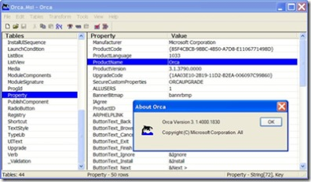

I just learned about this neat editor for creating and editing Windows Installer packages (.msi files) and merge modules (.msm files). <a href="http://msdn2.microsoft.com/en-us/library/aa370557.aspx" target="_blank" rel="noopener">Orca</a>&nbsp;is just one of many cool <a href="http://msdn2.microsoft.com/en-us/library/aa372834.aspx" target="_blank" rel="noopener">installer tools</a> by Microsoft. It provides a graphical interface for validation, highlighting the particular entries where validation errors or warnings occur. This <a href="http://support.microsoft.com/kb/255905" target="_blank" rel="noopener">KB255905</a> article explains more.

Orca is part of the platform SDK and locating the correct download was difficult - a lot of redirected pages and dead ends, but I found it as part of the <a href="http://www.microsoft.com/downloads/details.aspx?FamilyId=C2B1E300-F358-4523-B479-F53D234CDCCF&amp;displaylang=en" target="_blank" rel="noopener">Vista SDK download</a> as well as the <a href="http://www.microsoft.com/downloads/details.aspx?FamilyId=A55B6B43-E24F-4EA3-A93E-40C0EC4F68E5&amp;displaylang=en" target="_blank" rel="noopener">Windows Server 2003 SDK download</a>. Once you install the SDK, look for Orca.msi and install it separately.

Here is a screenshot of running Orca on the Orca.msi file ...

