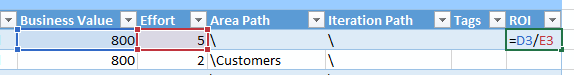
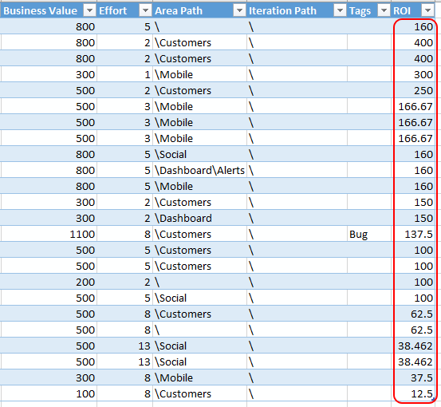
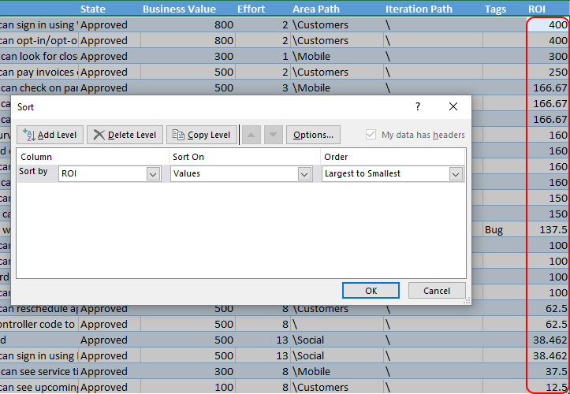
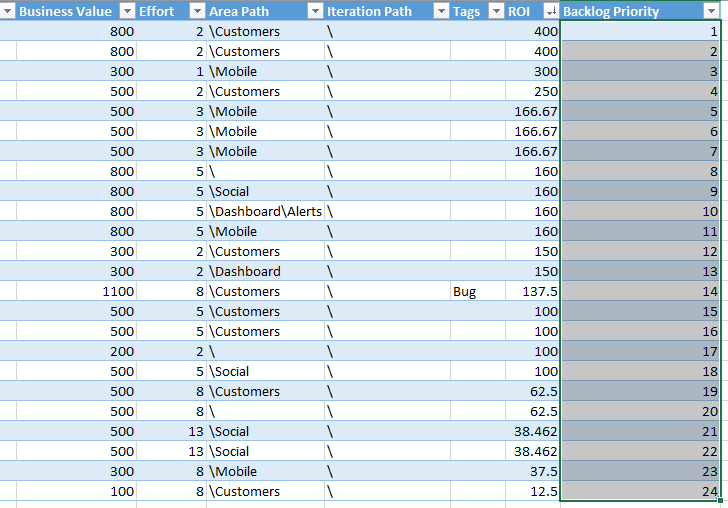

---
title: "Ordering the Product Backlog by ROI"
date: 2016-08-15T14:28:08Z
author: "Richard Hundhausen"
slug: "orderbyroi"
draft: false
tags: ["Azure DevOps", "Scrum", "TFS"]
---

---

The <a href="http://www.scrumguides.org/scrum-guide.html" target="_blank" rel="noopener">Scrum Guide</a> says that the Product Owner is the sole person responsible for managing the Product Backlog and that Product Backlog management includes ordering items in the Product Backlog "to best achieve goals and missions". One of the best ways to do that is to order based on the principle of Return on Investment (ROI). This is simply the numeric business value divided by the numeric effort (e.g. story points). This may sound easy, but it's not - mostly because Product Owners don't track (or even know how to track) business value. #ThisIsSad.

Let's ignore for a moment that business value (BV) is a unicorn measurement (along with productivity, technical debt, and a few others). We also have to assume that your Product Owner has found a way to determine the <em>relative</em> business value of items in the Product Backlog. Maybe he or she is using the <a href="https://en.wikipedia.org/wiki/MoSCoW_method" target="_blank" rel="noopener">MoSCoW</a> method, having stakeholders spend 100 virtual dollars, or some other technique. Another option is to craft and use a <a href="https://accentient.com/blog/measuring-the-business-value-of-a-pbi/" target="_blank" rel="noopener">custom Fibonacci list of values</a>. I like to add two zeroes to make it look more "valuey".

Next, be sure to track Business Value and Effort for each Product Backlog Item (PBI). I recommend using the Scrum process template to do this (since it's the only one that has a BV field). I also recommend <em>not</em> using the Bug work item type, as it <em>doesn't</em> have a BV field and can't compute ROI. Just use PBI work items for everything, adding a "Bug" tag if you must.

You can ignore the Priority field. You can also ignore the Value Area field. In fact, there are <a href="https://accentient.com/blog/microsoft-please-give-us-a-scrum-process-template/" target="_blank" rel="noopener">many fields (and capabilities)</a> that you can ignore when practicing Professional Scrum.

It can be helpful to display the Business Value column while you are managing the Product Backlog ...

Once all of the PBIs have values in their Business Value and Effort fields, you can create a new query (to be <a href="https://www.visualstudio.com/en-us/docs/work/office/bulk-add-modify-work-items-excel" target="_blank" rel="noopener">opened in Exce</a>l) ...

Next, manually add a new "ROI" column to the right of the query results ...

This column won't map to any field in the PBI work item.

Next, paste the formula into all of the ROI cells that divide the Business Value cell by the Effort cell (e.g. "=D3/E3") ...

Make sure the formula is replicated down all the rows ...

Next, turn off the Filter and sort on ROI in descending order ...

Next, add the <em>Backlog Priority</em> column and enter a series of numbers from 1 to n. You can do this by entering 1 in the first cell and 2 in the second cell and then selecting those two cells and <a href="https://support.office.com/en-us/article/Automatically-number-rows-76ce49e3-d8d2-459b-bd85-ee1d3973e6e6" target="_blank" rel="noopener">dragging the fill handles</a> down the range you want. The sheet should now look something like this ...

Next, Publish the changes back, return to the browser, press F5, and notice the newly ordered Product Backlog based on ROI!

Keep in mind that this is a one-time ordering of the Product Backlog. The computed ROI "column" only exists in the Excel workbook - which you can save if you want, so that later you can open it, click Refresh, and make any changes you need to. Also, your neat Backlog Priority values (1 to 24 in the above image) will be changed and re-<a href="https://blogs.msdn.microsoft.com/visualstudioalm/2014/05/14/behind-the-scenes-the-backlog-priority-or-stack-rank-field/" target="_blank" rel="noopener">sparsified</a> the next time the Product Owner drags and drops to change the order in the Backlog page.

There are many ways a Product Owner may order the Product Backlog by: priority, risk, dependency, learning opportunity, and others. Order the backlog simply based on their gut feeling is perfectly fine too. The proof will be in the Increment.
