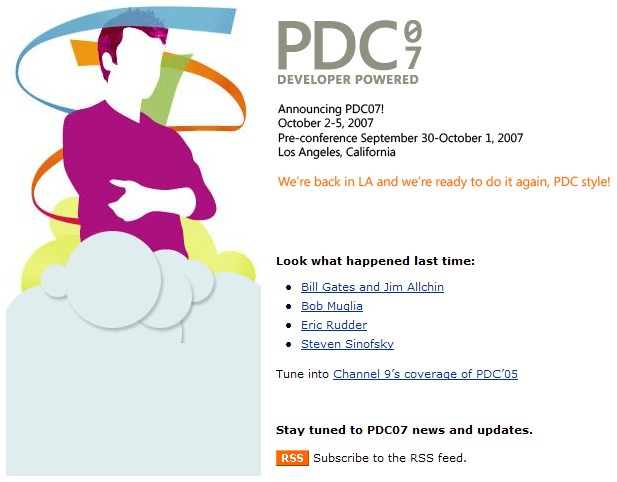

Microsoft will be holding the next Professional Developers Conference (PDC) October 2-5, 2007 in Los Angeles, with two days of pre-conference on September 30 and October 1.&nbsp; Save the date! 

The PDC is the definitive developer event focused on the future of the Microsoft platform.&nbsp;PDC 2007 attendees will have the opportunity to access new code, learn about the latest Microsoft product offerings and hear from Microsoft executives about the various platform developments.

Click <a href="http://msdn.microsoft.com/events/pdc/" target="none" rel="noopener">here</a> for more information.
