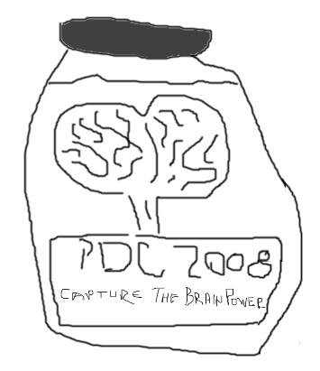

Whether you're attending <a href="http://www.microsoftpdc.com" target="_blank" rel="noopener">Microsoft's PDC</a> or not, The <a href="http://underground.socalcodecamp.com" target="_blank" rel="noopener">Underground</a> is the place to be!

&nbsp;

&nbsp;

&nbsp;

&nbsp;

&nbsp;

&nbsp;

&nbsp;

&nbsp;

&nbsp;

Microsoft and <a href="http://www.ineta.org" target="_blank" rel="noopener">INETA</a> have joined forces to bring you a truly amazing experience in downtown Los Angeles on the Wednesday during PDC. They've got a fantastic speakeasy evening lined up, one that's sure to leave a lasting impression. It'll be a great night of vignettes, networking, music, dancing, food and drinks!

<a href="http://underground.socalcodecamp.com" target="_blank" rel="noopener">Check it out</a>. See you there!