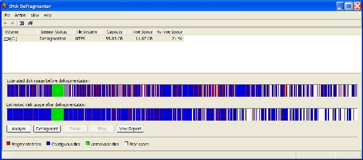
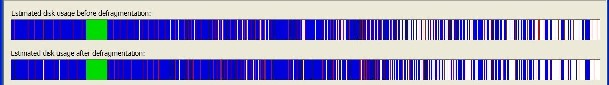
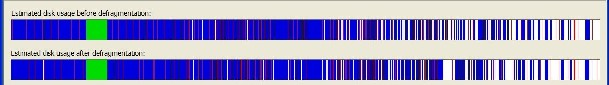
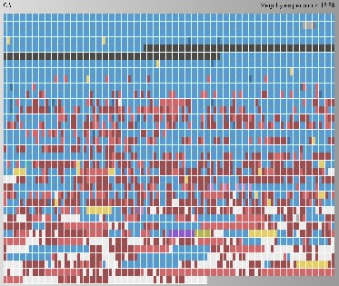
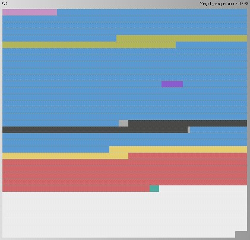
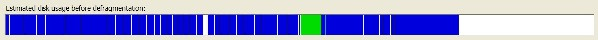

I'll have to admit that it's been a few years since I've studied&nbsp;and compared disk defragmenter software. I've always just right-clicked my drive and let Windows defrag it. I've never really been impressed, however,&nbsp;with the results, even after running it three times.

After the first run: 

After the second run: 

After the third run: 

So then I installed and ran <a href="http://www.perfectdisk.com/products/PerfectDisk2k/" target="none" rel="noopener">PerfectDisk 8.0</a> which beats the built-in defragmenter software in <a href="http://www.perfectdisk.com/products/perfectdisk2k/compareV8.cfm" target="none" rel="noopener">many ways</a>.

You can see the before: 

and after of its run: 

and then back to Windows to see its results: 
You decide for yourself!