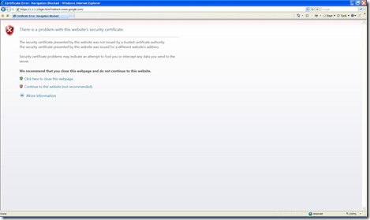
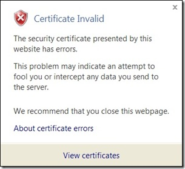
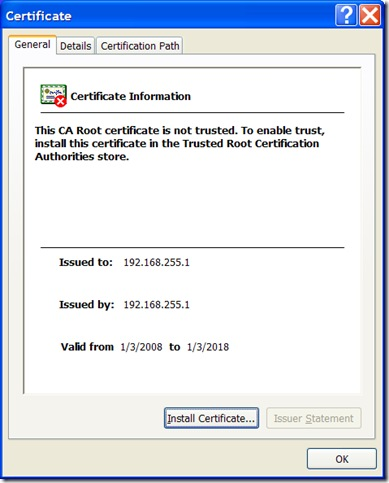
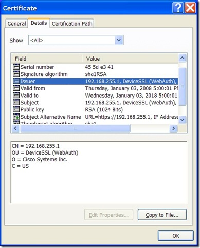

Can someone please help them? While traveling through <a href="http://phoenix.gov/AVIATION" target="_blank" rel="noopener">PHX</a> today, on my way to Houston, I logged on to their "Sky Harbor Public WLAN" and actually got connected. They must have upgraded their gear, because a year ago it was not so friendly. Also, all of the US Airways clubs have ditched their private wireless networks and gone with using the general Sky Harbor Public WLAN network, which means even more travelers will see this embarrassing error:
 
&nbsp;&nbsp;
  
&nbsp;&nbsp; 
  
Maybe I can convince my friends in the <a href="http://www.azdnug.com" target="_blank" rel="noopener">Phoenix web-dev community</a> to give them a call at (602) 273-3300 and help them out!
