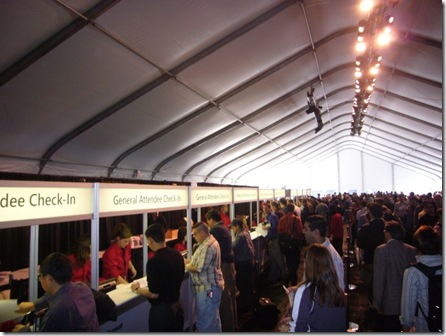
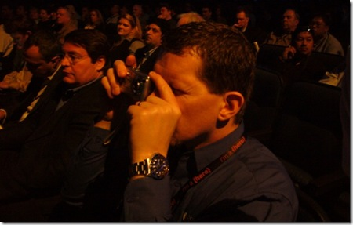
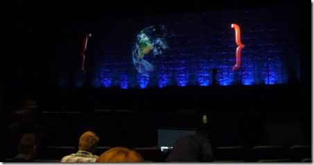
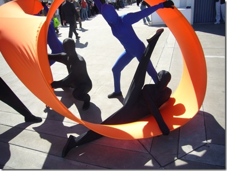
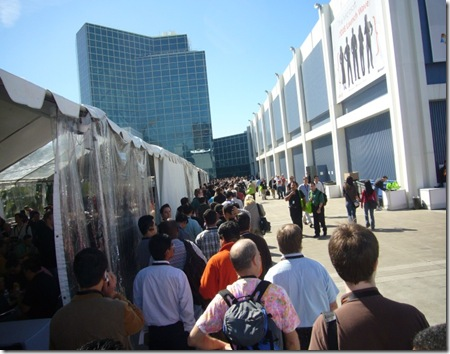
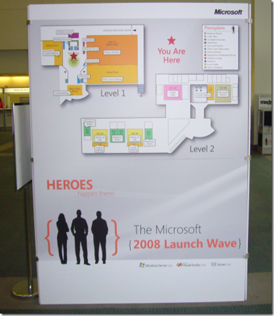
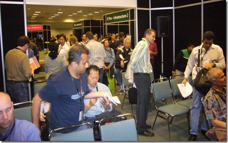
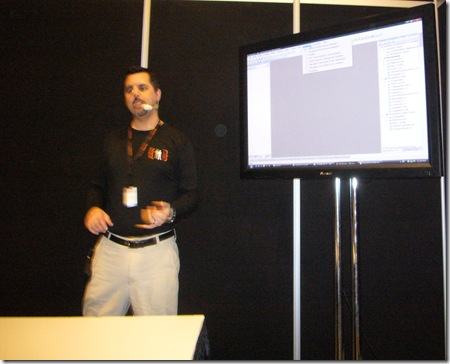
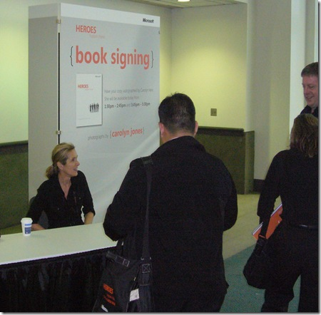

Back home now, and I have a moment to get the photos downloaded from my camera and uploaded to my blog. Next time I'll take my SD card reader with me.
 
As you can see, registration was quite busy. I heard that there were 4000 people there, but didn't count them myself. The long lines delayed the keynote by about an hour:
 
 
 
Douglas McDowell and I snuck into the press area. Well, he was officially press (SQL Server Magazine), but I wasn't - still I took more notes than most of the other pressies there.
 
 
 
The main screen was huge, and 3D. We estimated about 80' wide and 20' tall. When no slides were on the screen, there was a spinning 3D Earth enclosed in curley brackets. Hey, what about VB?
 
 
 
After the keynote, there was a short walk to the LA convention center, where the breakout sessions, chalk-talks, exhibitor area, etc. Fortunately, we had these interpretive dancers along the way to keep us from getting lost.
 
 
 
The line to lunch was too long, so we ducked inside to check out the exhibitor area.
 
&nbsp;
 
I was there (where it says "You Are Here")
 
 
 
Attendees attending one of <a href="http://blogs.msdn.com/dseven" target="_blank" rel="noopener">Doug Seven's</a> chalk talks on Team System.
 
 
 
Doug was all about the <a href="http://msdn2.microsoft.com/en-us/library/4dtdybt8.aspx" target="_blank" rel="noopener">writing quality code</a> and the 3 C'2013-08-28 13:39:45's in his talk (Code Coverage, Code Analysis, and the new <a href="http://msdn2.microsoft.com/en-us/library/bb385910.aspx" target="_blank" rel="noopener">Code Metrics</a>)
 
 
 
After I turned in my evaluation form, I picked up the attendee bag, which had&nbsp; lots of goodies, including a hard-bound, coffee-table style book called "Heroes Happen Here" which contains IT heroes from all around the world, photographed by <a href="http://www.carolynjonesphoto.com/" target="_blank" rel="noopener">Carolyn Jones</a>. And yes, I got my book signed!
 

