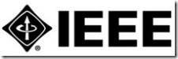

The Annual Banquet for the <a href="http://www.ewh.ieee.org/r6/boise" target="_blank" rel="noopener">Boise Chapter</a> of the <a href="http://www.computer.org" target="_blank" rel="noopener">IEEE Computer Society</a> will be held on Wednesday, October 24, 2007 at the 8th Street Winery from 6:30 to 8:30pm.
 
The presenters this year are <a href="http://www.ugobe.com/who/bios_management.html#caleb" target="_blank" rel="noopener">Caleb Chung</a> and <a href="http://www.ugobe.com/who/bios_management.html#john" target="_blank" rel="noopener">John Sosoka</a> of <a href="http://www.ugobe.com" target="_blank" rel="noopener">Ugobe Systems</a> and they will talk about innovation and the making of Pleo.
 

