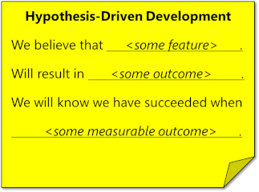
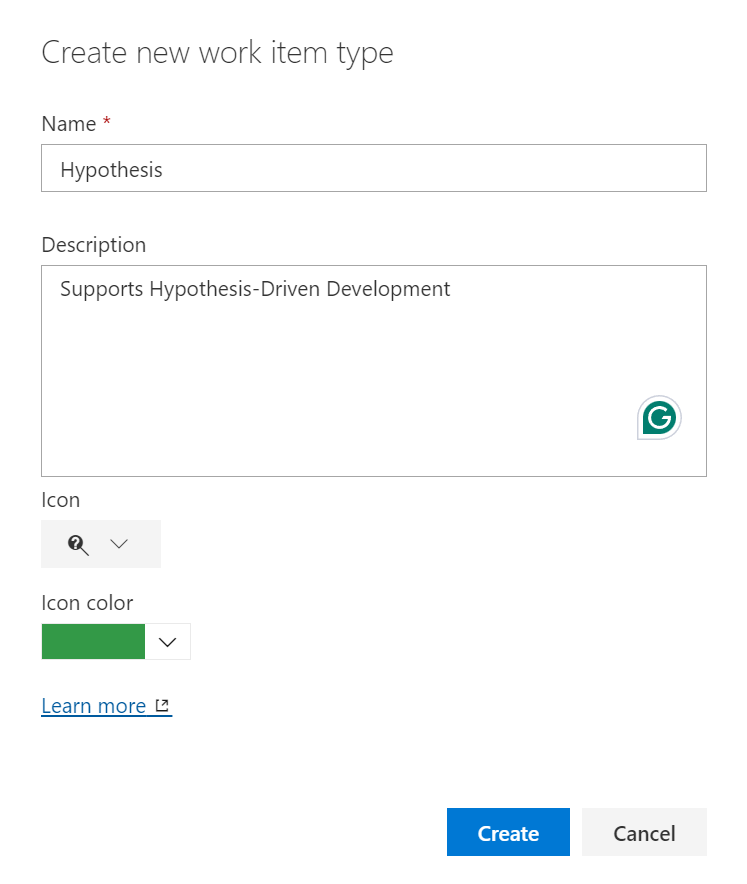
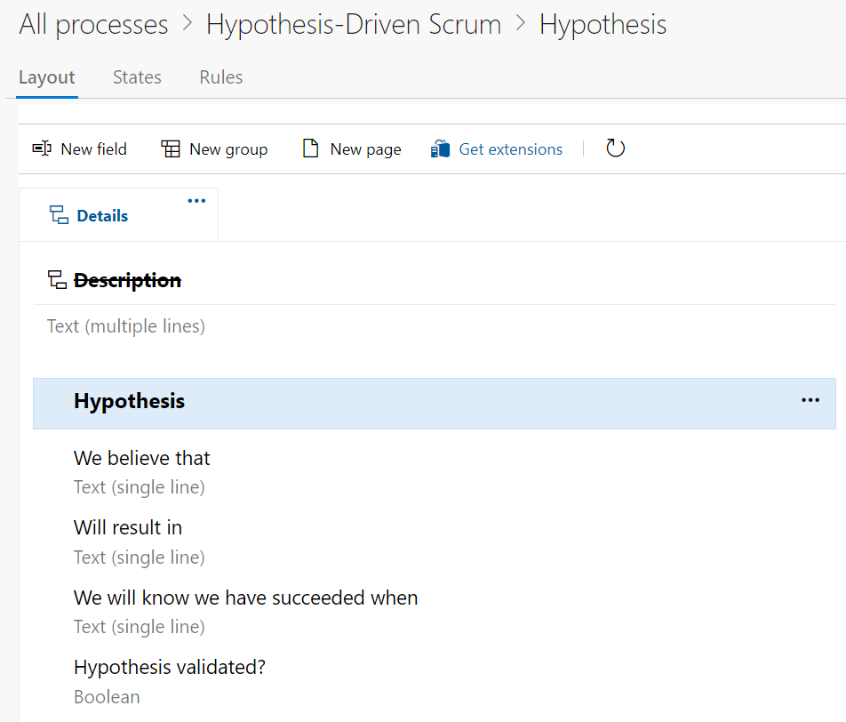
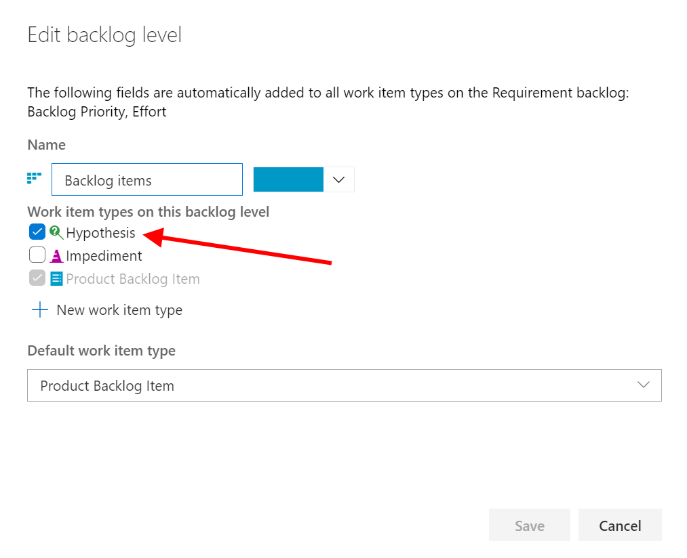
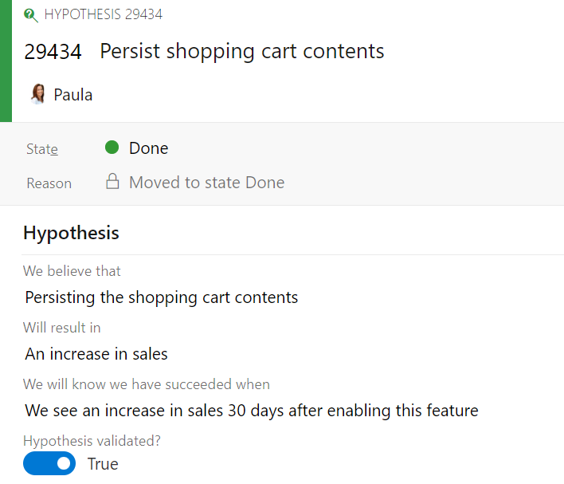

I like to think of Scrum Product Owners as mini-CEOs of their product. As such, they should be empowered to drive value in any direction that they desire. This often requires a Product Owner to hypothesize about an outcome and then run an experiment to prove or disprove it. Rather than just building features blindly, a Professional Product Owner bases their decisions on data.

<strong>Hypothesis-Driven Development</strong>

Hypothesis-Driven Development (HDD) is a complementary practice that incorporates an experimentation-based approach to product development. With HDD, each Product Backlog item (e.g. feature or user story) begins with a clearly defined hypothesis that predicts how this new capability will impact user behavior or achieve specific outcomes. The results from these experiments guide the next steps: whether to iterate, pivot, or abandon - all based on actual data rather than just guessing.

<blockquote class="wp-block-quote has-small-font-size">

“Test-Driven Development is a great excuse to think about the problem before you think about the solution. Hypothesis-Driven Development is a great opportunity to test what you think the problem is before you work on the solution.”

<cite>Kent Beck, creator of eXtreme Programming</cite></blockquote>

HDD, based on Lean principles, can enhance Scrum's iterative nature by ensuring that the development of risky/costly items is based on empirical evidence and real user feedback, fostering a more focused and adaptive product development process.

<strong>Practicing Hypothesis-Driven Development</strong>

There are several ways to practice HDD and craft a hypothesis. I like the format put forward in this <a href="https://www.thoughtworks.com/en-us/insights/articles/how-implement-hypothesis-driven-development" target="_blank" rel="noopener" title="">Thoughtworks post</a> by Barry O'Reilly as it's akin to the user-story description format ...

<figure class="wp-block-image size-full"></figure>

<strong>Creating a Hypothesis work item type in Azure DevOps</strong>

The first step is to create a custom work item type in your Azure DevOps project. You will need to have the appropriate permissions to do this. Refer to <a href="https://learn.microsoft.com/en-us/azure/devops/organizations/settings/work/inheritance-process-model" target="_blank" rel="noopener" title="">this page</a> for more information. I will, of course, create an inherited process based on the Scrum process, naming it <em>Hypothesis-Driven Scrum</em> and adding a new <em>Hypothesis</em> work item type ...

<figure class="wp-block-image size-full has-custom-border"></figure>

Next, I'll add the supporting fields and make any other tweaks (such as hiding the Description field) ...

<figure class="wp-block-image size-full has-custom-border"></figure>

I'll also edit the Backlog levels and include the new Hypothesis work item type on the Backlog items backlog ...

<figure class="wp-block-image size-full has-custom-border"></figure>

This is an optional step, but if you don't do this, then you will need to create a custom work item query to retrieve all of your Hypothesis work items. You might want to do this anyway so that you could have a dedicated dashboard showing the various hypotheses.

<strong>Forming and testing a hypothesis</strong>

Next, I'll create a new Azure DevOps project (or convert an existing one to use the new process). This provides me access to the new work item type, which I can start using to form, track, and manage my hypotheses, such as this one ...

<figure class="wp-block-image size-full has-custom-border"></figure>

<strong>Summary</strong>

Should you practice HDD with every item in the Product Backlog? I wouldn't. But, for those tricky, risky, and expensive features, I would definitely consider this approach, or at least starting to think in terms of hypothesis (and the expected, measurable outcomes), to help ensure that the product aligns with user needs as well as business and product goals.

Leveraging empirical evidence to make informed decisions? Sounds like good Scrum to me!
