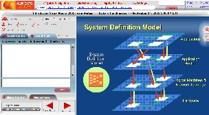

 This was a last minute thing that came up, but yesterday morning I presented a <a href="http://www.almexpo.com/content/view/56/50/" target="none" rel="noopener">1-hour session</a> on Team System to this <a href="http://www.almexpo.com/" target="none" rel="noopener">virtual conference</a>. I understand that they had 4500+ attendees signed-up. I know that my session had 100 people in it, which is great for a conference that was devoid of any specific tools (most topics were on management, theory, and best practice).

 (Click to expand)
