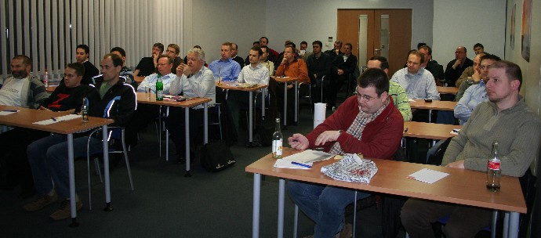
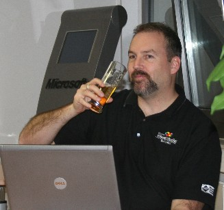

Thank you to my friends at <a href="http://www.basta.net/" target="none" rel="noopener">Basta!</a> for recommending me as an alternate speaker for the <a href="http://www.dotnet-ug-frankfurt.de/" target="none" rel="noopener">Frankfurt .NET User Group</a> meeting last week. Thomas "<a href="http://teddysohnrey.blogspot.com/" target="none" rel="noopener">Teddy</a>" Sohnrey was the coordinator (and my interpreter at times).

The topic was <em>Effective SCM using Visual Studio Team System</em>, and I enjoyed sharing my approaches and best practices to the many software developers in the room.

Of course, what I will remember most about the evening is the venue: Microsoft's <a href="http://www.microsoft.com/germany/unternehmen/informationen/gmbh_profil/niederlassungen/badhomburg.mspx" target="none" rel="noopener">office</a> in Bad Homburg, and the free beer in the break room!
 