---
title: "Creating a Product Backlog Treemap"
date: 2019-05-02T13:28:43Z
author: "Richard Hundhausen"
slug: "product-backlog-treemap"
draft: false
tags: ["Azure Boards", "Scrum"]
---

---

Product Backlogs are boring. Not only are they one dimensional, but they are often unordered. This is to say nothing of their potential lack of information as well. (User) story maps are way more interesting. Not only are they two dimensional, but they group features and ideas and help to visualize the release plan. Also, teams that practice story mapping tend to be more Agile, with engaged Product Owners and stakeholders. <a rel="noreferrer noopener" aria-label="SpecMap  (opens in a new tab)" href="https://marketplace.visualstudio.com/items?itemName=techtalk.specmap" target="_blank">SpecMap </a>is a great story mapping Azure Boards extension by the way.

Enter the Treemap. <a rel="noreferrer noopener" aria-label="Treemapping (opens in a new tab)" href="https://en.wikipedia.org/wiki/Treemapping" target="_blank">Treemapping</a> is a method for displaying hierarchical data using nested figures, usually rectangles. Each "branch" of the tree is given a rectangle, which can also be tiled with smaller rectangles representing sub-branches. A leaf node's rectangle has an area proportional to a specified dimension of the data. Often the leaf nodes are colored to show a separate dimension of the data. When the color and size dimensions are correlated in some way with the tree structure, one can often easily see patterns that would be difficult to spot in other ways.

<h3><strong>Start with a Refined Product Backlog</strong></h3>

I'm starting with a Product Backlog with 50 Product Backlog Items. I generated it just for this blog post, so don’t criticize me too much. Each item has been associated with a product <a aria-label="Area (opens in a new tab)" href="https://docs.microsoft.com/en-us/azure/devops/organizations/settings/set-area-paths?view=azure-devops" target="_blank" rel="noreferrer noopener">Area</a>. Each item has a Business Value of (100, 200, 300, 500, 800, 1300, or 2100) and an Effort (1, 2, 3, 5, 8, 13, 21). The Business Value was provided by Paula, the Product Owner. The Development Team provided the Effort. The Product Backlog has been initially ordered by ROI (BV/Effort) until Paula determines a better way to order it.

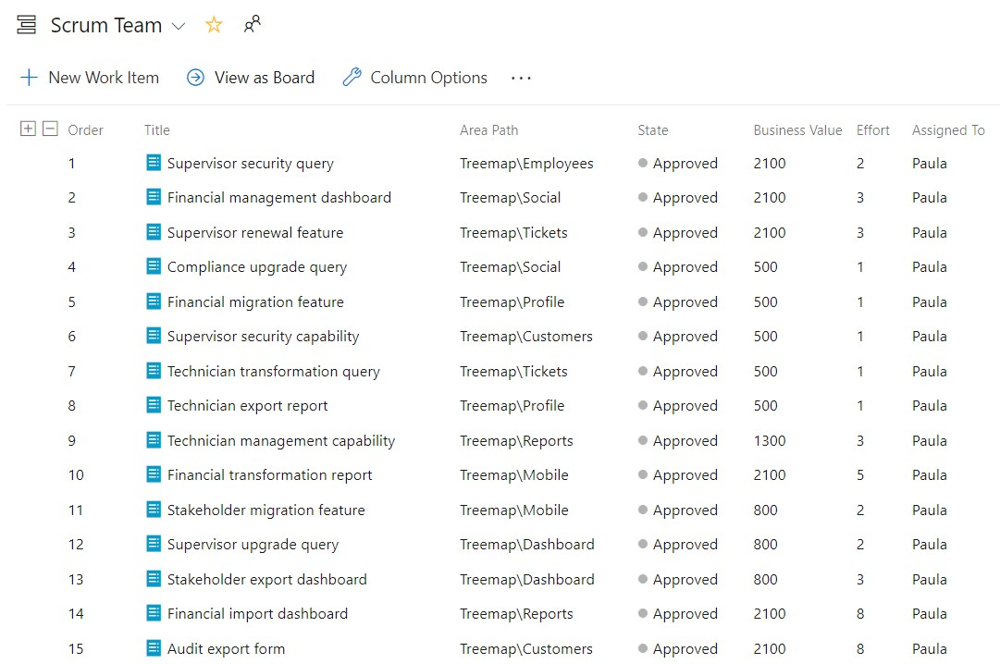

<h3>Personal Access Token</h3>

You will need a <a aria-label=" (opens in a new tab)" href="https://docs.microsoft.com/en-us/azure/devops/organizations/accounts/use-personal-access-tokens-to-authenticate?view=azure-devops" target="_blank" rel="noreferrer noopener">Personal Access Token</a> (PAT) to access the Analytics OData feed. Tokens are a nice choice for authentication because they are distinct from a user’s password, they automatically expire (so you don't have to remember to manage it), and they can be revoked at any time. You can generate the token from your Security details page. It only needs to have <em>Read</em> access to the <em>Analytics</em> scope.

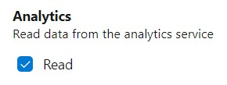

Be sure to copy the token and save it somewhere temporarily.
It will essentially be your password to access the Analytics service from Power
BI Desktop.

<h3> <strong>Run Power BI Desktop and Connect to the OData feed</strong></h3>

<a href="https://powerbi.microsoft.com/en-us/desktop/">Powe</a><a href="https://powerbi.microsoft.com/en-us/desktop/" target="_blank" rel="noreferrer noopener" aria-label="r BI Desktop (opens in a new tab)">r BI Desktop</a> is a free application you can install on your local computer that lets you connect-to, transform, and visualize data from a number of sources, including the Azure DevOps Analytics service. You’ll find Power BI Desktop in the Microsoft Store. Launch Power BI Desktop and sign-in, sign-up, or skip it altogether. Next, click Get Data, select OData feed, and enter the analytics URL of your Azure DevOps Services organization:

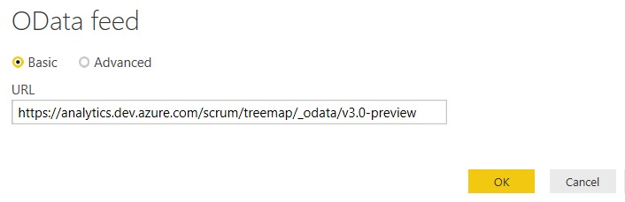

As you can see from my URL, my Azure DevOps Services organization is <em>scrum</em>, my team project is <em>treemap</em>, and I’m accessing the 3.0<em>-preview</em> <a href="https://docs.microsoft.com/en-us/azure/devops/report/extend-analytics/odata-api-version?view=azure-devops#released-versions" target="_blank" rel="noreferrer noopener" aria-label=" (opens in a new tab)">OData feed version</a>. By the time you read this, 3.0 may be out of preview, or an even newer version may be available.

There are several <a href="https://docs.microsoft.com/en-us/azure/devops/report/powerbi/client-authentication-options?view=azure-devops" target="_blank" rel="noreferrer noopener" aria-label=" (opens in a new tab)">methods to authenticate</a> to the OData feed. Since I have a Personal Access Token, I chose Basic, typed “User” (which works for everyone), and pasted my Personal Access Token into the password field.

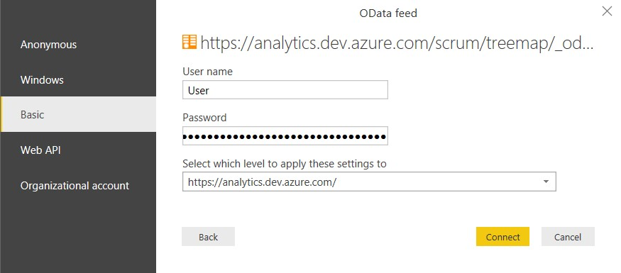

<h3>Load Work Items and Related Tables</h3>

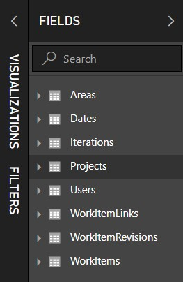

Once connected, you will see that the Analytics Service provides many <a href="https://docs.microsoft.com/en-us/azure/devops/report/extend-analytics/data-model-analytics-service?view=azure-devops#work-tracking-entitysets" target="_blank" rel="noreferrer noopener" aria-label=" (opens in a new tab)">entity sets</a>. Depending on the version you connected-to, these entities represent queryable data from Azure Boards, Azure Repos, Azure Test Plans, Azure Pipelines, and more. Entities that contain the name <em>Snapshot</em> contain the state of every work item on every day since each work item was created. For repositories of any size this could lead to millions of work items, which may not load. These types of entities are intended only for aggregation queries.

I selected <em>WorkItems</em>,
clicked <em>Select Related Tables</em>, and
then clicked <em>Load</em>. After a few
moments, the tables will load and you can probably ignore any errors. After
that, you can see the tables in the <em>Fields</em>
picker.

<h3>Visualize my Product Backlog</h3>

I expanded the WorkItems table, and selected Title, Business Value, and Effort. From the Areas table, I selected AreaName. Next, I renamed and reordered a couple of columns and tweaked the formatting a bit. Finally, I created a new ROI <a href="https://docs.microsoft.com/en-us/power-bi/desktop-tutorial-create-calculated-columns" target="_blank" rel="noreferrer noopener" aria-label=" (opens in a new tab)">calculated column</a>:

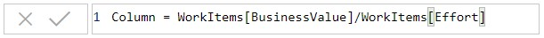

Now I have a Product Backlog visualization in PowerBI desktop:

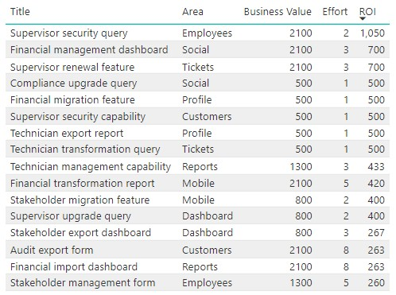

But we are here for a Treemap, not a list. We could have
generated that in Azure Boards!

<h3><strong>Treemap It</strong></h3>

I leave Focus mode, by clicking the <em>Back to report </em>link, and then change my visualization to a Treemap. As you can see, Power BI Desktop provides many <a rel="noreferrer noopener" href="https://docs.microsoft.com/en-us/power-bi/visuals/power-bi-visualization-types-for-reports-and-q-and-a" target="_blank">visualizations</a>. You should definitely experiment, but don't settle for anything boring!

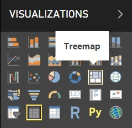

Next, I set the Group to <em>Area</em>, Values to <em>Effort</em> (which I renamed to <em>Size</em> because I like that term better) and Tooltips to <em>BusinessValue</em>.  

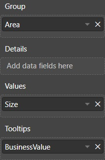

I then decided to apply conditional formatting (a.k.a. <a rel="noreferrer noopener" href="https://powerbi.microsoft.com/en-us/blog/power-bi-desktop-august-2017-feature-summary/#fontColorScales" target="_blank">color scales</a>) to the branches, based on the Business Value sum. I went to Format &gt; Data Colors and opened the Advanced controls. I based the color scale on the sum of BusinessValue (in WorkItems). Next, I set the Minimum/lowest value color to custom <em>0EFF00</em> (light green) and the Maximum/highest value to custom <em>063B00</em> (dark green). 

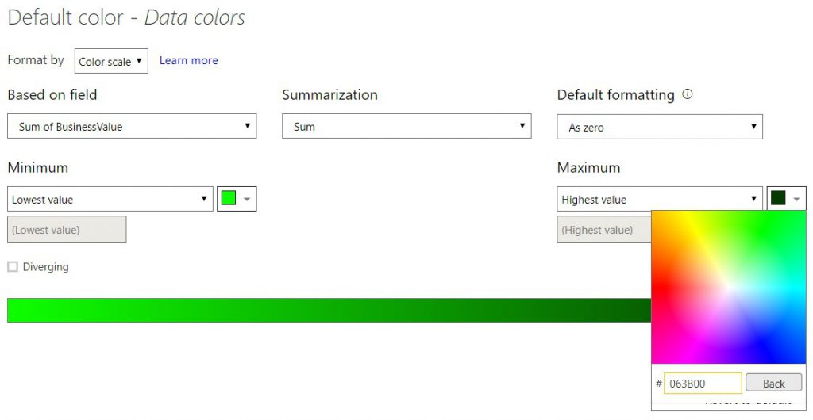

With a couple of formatting tweaks to the labels and title, my
Treemap is done …

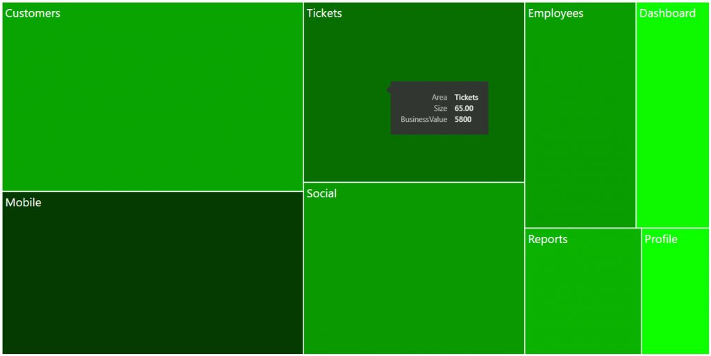

The size of the shape represents the sum of the Size (Effort) fields of the PBIs in that area and the darkness of green represents the sum of the Business Value ($) fields of the PBIs in that area. Hovering over any shape will give you the details.

Now, at a glance, Paula can see that Mobile, although a large investment should provide a good return - much more so than Customers which is about the same size investment.

Once the report looks sweet, you could <a href="https://docs.microsoft.com/en-us/azure/devops/report/powerbi/publish-power-bi-desktop-to-power-bi?view=azure-devops" target="_blank" rel="noreferrer noopener" aria-label="publish it to to PowerBI.com (opens in a new tab)">publish it to to PowerBI.com</a> in order to share with others on your team or in your organization.

