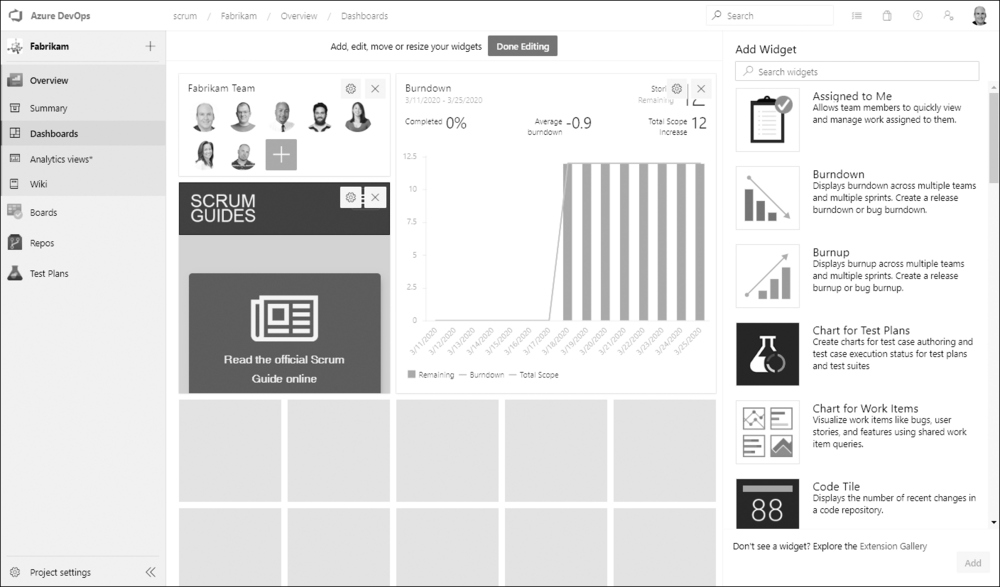

When you create a dashboard in Azure DevOps, you make a choice that's easy to breeze past: is this a project dashboard or a team dashboard? They look similar and they're built from the same widgets, but they serve different audiences and they're owned differently. Getting the distinction right keeps your information radiators from turning into a confusing pile of overlapping signboards, especially once you're running more than one team.

A project can host several dashboards, each serving a specific purpose. Each one hosts an array of widgets that display real-time information about the product or process. You add them in the Overview hub, dropping widgets like burndowns, query charts, and Markdown tiles onto the canvas.

<figure class="wp-block-image size-large has-custom-border"></figure>

<strong>Project dashboards</strong>

Project dashboards display information or status about the project as a whole. The important thing to know about them is that they also have configurable permissions. That makes them the right place for project-level status that a wider audience needs to see: overall progress, quality trends, the kind of high-level picture a sponsor or a manager wants. Because you can configure who can view and edit them, you can radiate project status broadly while still controlling who gets to change it.

<strong>Team dashboards</strong>

Team dashboards provide focused information specific to that team. They're part of the suite of agile tools each team gets, and the Team Administrator manages them. A team dashboard is where the Developers pin the things they care about during the Sprint: their Sprint burndown, their query tiles, their flow charts. It radiates that team's reality, not the whole project's.

<strong>Who owns which, and why scale matters</strong>

For an Azure DevOps project that only has one team, the default team, project dashboards work just fine. There's only one team and one project view, so the distinction barely matters. Keep it simple.

The distinction starts paying off in a scaled environment, such as a <a href="https://scrumguides.org/" target="_blank" rel="noopener">Scrum</a> setup using the Nexus framework. When you have several teams in one project, it makes sense for each team to have its own dashboard radiating its own information. Each Team Administrator owns and curates their team's view. Meanwhile, a project dashboard, with its configurable permissions, becomes the shared, higher-level radiator that shows status across the whole effort. The Product Owner and stakeholders look there for the integrated picture, while each team looks at its own board for its own work.

So the rule of thumb is simple. Team-specific, day-to-day, Sprint-level information goes on team dashboards owned by Team Administrators. Project-wide status that a broad audience needs, with controlled permissions, goes on project dashboards. Match the dashboard to the audience and the owner, and your radiators will inform instead of clutter. Sounds like good Scrum to me.

