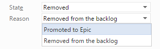

---
title: "Promoting a PBI to a Feature (Epic)"
date: 2015-01-29T11:27:29Z
author: "Richard Hundhausen"
slug: "promoting-a-pbi-to-a-feature"
draft: false
tags: ["Scrum", "TFS"]
---

---

For Scrum Teams using TFS 2013 to create and manage their Product Backlog, they may want to take advantage of the new <a href="https://msdn.microsoft.com/en-us/library/dn306083.aspx" target="_blank" rel="noopener">Agile Portfolio</a>. This "higher level" backlog allows a team or organization to plan and track initiatives, features, epics, etc. The term "Feature" is the default, but with on-premises TFS, you can <a href="https://msdn.microsoft.com/en-us/library/vstudio/hh543813.aspx" target="_blank" rel="noopener">customize</a> this.

Recently, a team I was working with renamed <em>Feature</em> to <em>Epic</em>, and then wanted to "promote" several of their current PBI work items to Epics. I supported this decision, because it helps keep the Product Backlog "pure" - only containing items than can actually be developed. I wrote a script to create Epics which were basically copies of the respective PBIs. Part of this script was to set the original PBI to the <em>Removed </em>state, but I wanted to add a new reason that was more meaningful than "Removed from the backlog".

Step 1 - I edited the Product Backlog Item work item type definition to add a new Reason ...

<strong>&lt;TRANSITION from="Approved" to="Removed"&gt;
&lt;REASONS&gt;
&lt;DEFAULTREASON value="Removed from the backlog" /&gt;
&lt;REASON value="Promoted to Epic"/&gt;
&lt;/REASONS&gt;
&lt;/TRANSITION&gt;</strong>

Step 2 - I removed the <em>ReadOnly="True"</em> attribute from the respective Control (if necessary) ...

<strong>&lt;Control Type="FieldControl" FieldName="System.Reason" LabelPosition="Left" Label="Reason" ReadOnly="True"/&gt;</strong>

After importing the updated WITD and refreshing the page, I get the capability I want ...

