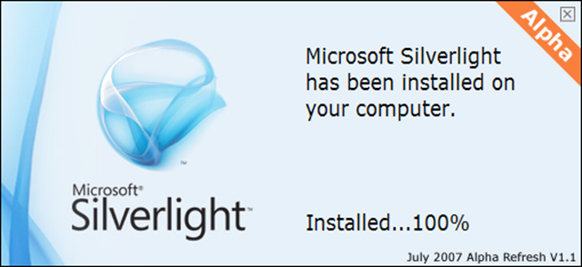

---
title: "Quality Enablement through Agile Testing"
date: 2013-11-06T16:49:29Z
author: "Richard Hundhausen"
slug: "quality-enablement-through-agile-testing"
draft: false
tags: ["TFS", "Visual Studio"]
---

---

Thank you for attending last week’s Quality Enablement through Agile Testing event put on by Microsoft here in Boise.
 

 
I hope you had fun exploring the testing tools in Visual Studio and Team Foundation Server. I know that I enjoyed co-presenting with <a href="http://blogs.msdn.com/b/jasonsingh/" target="_blank" rel="noopener">Jason Singh</a> and <a href="http://blogs.msdn.com/b/slange/" target="_blank" rel="noopener">Steve Lange</a>. I also enjoyed explaining and demonstrating how <a href="http://msdn.microsoft.com/en-us/library/vstudio/dd997438.aspx" target="_blank" rel="noopener">Lab Management</a> can simplify your build &gt; deploy &gt; test lifecycle.
 
Attachment: <a href="LM Best Practices.pdf" target="_blank" rel="noopener">LM Best Practices.pdf</a>

