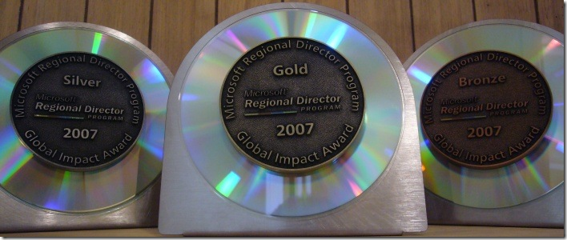

I had to show off my three amigos here. In 2007, <a href="https://accentient.com/blog/MicrosoftRegonalDirectorGlobalReachAwards.aspx" target="_blank" rel="noopener">as in 2006</a>, I logged enough Global Impact activities to achieve the gold status award. Along with it came the bronze and silver awards as well. This time, they are mounted to more easily sit on a shelf ... or so that the RDs don't try to use them in a car wash or something.
 
 
 
... and I'm already hard at work in 2008 working to link companies and the community with Microsoft.
 
Congrats to some of my fellow RDs who also achieved the gold award: <a href="http://blogs.mscommunity.net/blogs/tbronzin/archive/2008/03/27/microsoft-regional-director-program-global-impact-award-2007-gold-medal.aspx" target="_blank" rel="noopener">Tomislav Bronzin</a> (Croatia), <a href="http://tomicic.de/2008/03/25/MicrosoftRegionalDirectorProgramGoldGlobalImpactAward2007.aspx" target="_blank" rel="noopener">Damir Tomicic</a> (Germany), <a href="http://www.angrycoder.com/jonathangoodyear" target="_blank" rel="noopener">Jonathan Goodyear</a> (US), <a href="http://tgolonka.blogspot.com/2008/04/zoty-medal-dla-polski-i-dla-mnie-gold.html" target="_blank" rel="noopener">Tedeusz Golonka</a> (Poland), <a href="http://www.vinodunny.com/blog/post/MS-RD-Global-Impact-Award.aspx" target="_blank" rel="noopener">Vinod Unny</a> (India), and 40 others.
 
Learn more about the Microsoft Regional Director (RD) program <a href="http://msdn2.microsoft.com/en-us/isv/bb190468.aspx" target="_blank" rel="noopener">here</a>.
