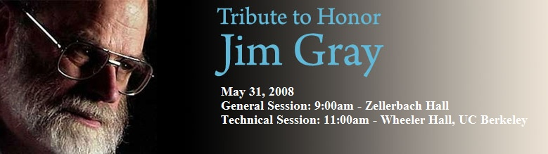

Time flies. It has been a year since Dr. Gray, a Microsoft research fellow and Turing Award-winner, <a href="http://www.helpfindjim.com" target="none" rel="noopener">went missing</a> while sailing off San Francisco. A year ago, at Boise Code Camp 2.0, I hosted a session on <a href="https://accentient.com/blog/HelpFindJimGray.aspx" target="none" rel="noopener">finding Jim Gray</a>, using Amazons Mechanical Turk.

Now, a year after Dr. Gray went missing, the <a href="http://www.acm.org" target="none" rel="noopener">Association of Computing Machinery </a>(the organization that holds the Turing Awards), the IEEE Computer Society and the University of California-Berkeley have joined to announce a tribute to Gray, planned for May 31 at the UC Berkeley campus. Jim Gray attended UC Berkeley from 1961 to 1969 and earned the schools very first Ph.D. in computer science. Fittingly enough, the tribute will also feature technical sessions for registered participants.

You can find more information about the tribute here:
