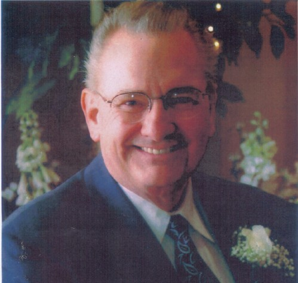

Yesterday, I went to a <a href="http://www.magicvalley.com/obituaries/?type=obit&amp;id=73007" target="none" rel="noopener">memorial</a> in Twin Falls, Idaho&nbsp;for&nbsp;Dale "Doc" Stukenholtz. Doc gave me my first computer programming job at <a href="http://www.stukenholtz.com/" target="none" rel="noopener">Stukenholtz Laboratory</a> in December 1984, working on an <a href="http://en.wikipedia.org/wiki/PC_AT" target="none" rel="noopener">IBM AT</a> and writing BASIC programs to lookup soil and plant nutrient values and recommend chemical compositions for various crops and yields.

As Gary Baker said during his Memories of a Life Well Lived: "when we lost Dale, a library burned". Never was a truer statement spoken. Always the teacher (and often the student)&nbsp;Doc&nbsp;maintained a vast knowledge:&nbsp;agronomy, sports, business,&nbsp;science, history, and even a conspiracy theory or two.

Doc believed in me, and I will never forget that!
