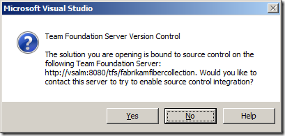
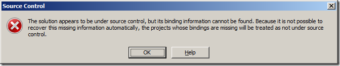

---
title: "Removing TFS bindings from solutions and projects"
date: 2012-10-10T11:24:17Z
authors: ["Richard Hundhausen"]
slug: "removing-tfs-bindings-from-solutions-and-projects"
draft: false
tags: ["TFS", "Visual Studio"]
---

---

When you try to open a solution that is under Team Foundation Server Version Control for a TFS that you don’t have access to, you will receive the message "The solution you are opening is bound to source control on the following Team Foundation Server" …
 

 
Clicking Yes is pointless, because you don’t have access to the TFS. Your only option is to click No. When you No, you are shown a message that "The solution appears to be under source control, but its binding information cannot be found" …
 

 
Clicking OK will allow you to work temporarily as though the solution and projects are not under source control. When you close and reopen the solution, the whole cycle repeats again. #pain
 
If you want to permanently break the bindings, unfortunately Visual Studio won’t be able to help. Neither will the TFS Power Tools. I know that the current and previous versions of the <a href="http://msdn.microsoft.com/en-us/library/ms181375(v=vs.110).aspx" target="_blank" rel="noopener">MSDN documentation</a> says that you can do this from the File &gt; Source Control window, but when you don’t have access to the TFS (that those solutions/projects are bound to), it’s impossible.
 
There is a <a href="http://social.msdn.microsoft.com/Forums/en-US/tfsgeneral/thread/1edd4885-c072-4c15-b546-c21ca506a23f" target="_blank" rel="noopener">workaround</a>, but it’s to <em>manually</em> edit all the .sln and .proj files and remove the relevant sections. #morepain
 
So I just built a simple Unbind command-line utility that does this for me …
 <ul> <li>The utility is written in C# using Visual Studio 2012  <li>Download, review, build, and run the utility in the folder containing the .sln file  <li>It recursively looks for any *.sln or *.*proj files in that folder and subfolders  <li>It opens that file and removes any lines that start with a tab + "scc" or "&lt;scc"  <li>It also removes any lines (inclusive) to the "globalsection(teamfoundationversioncontrol)" and corresponding "endglobalsection"  <li>A log file is generated  <li>Make a BACKUP first!</li></ul> 
I’ve tested it on a couple of solutions (i.e. Microsoft’s Fabrikam Fiber application) and it works fine. You may have to tweak it for your environment.
 
Download and use at your own risk after first making a backup!
 
Files: <a href="unbind.zip">Unbind Utility (4.0 mb)</a>

