---
title: "Rename a TFS Project Collection"
date: 2013-03-14T09:00:53Z
authors: ["Simon Reindl"]
slug: "rename-a-tfs-project-collection"
draft: false
tags: ["TFS"]
---

---

I was asked the other day how to rename a Team Project Collection.

There is a way, and it is more like a three card shuffle than anything else, and will work in TFS2010 and TFS2012.

The super quick guide: You detach the collection, and rename it on the reattach.
<h3></h3>
<h3>The step by step guide</h3>
1. Notify all the users and agree a time to do this, allocate at least half an hour to have breathing space.

You need to ensure that there are no builds or tests running, and have enough time to reset the build and test controllers and agents to point to the renamed collection. This is also assuming that you are going to keep the collection on the same SQL instance. so don’t need to consider the move from Enterprise to Standard edition (compression).

2.  Log on to the server locally

3. Open the Team Foundation Server Administration Console

<a href="image_2.png">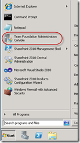</a>

Accept the User Access Control if shown

<a href="image_4.png">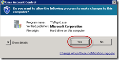</a>

4. In the console

a) Click on Team Project Collections

b) Click on the Team Project that you want to rename

c) Detach the collection

Note: The collection will get stopped and a servicing message will get displayed in the detach operation

<a href="image_12.png">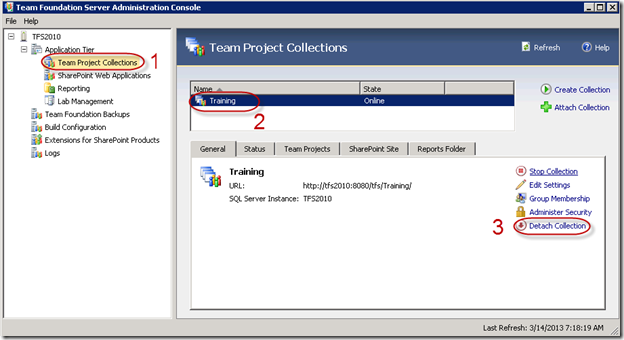</a>

5. This will invoke the detach wizard

a) Add a servicing message, and click next

<a href="image_14.png">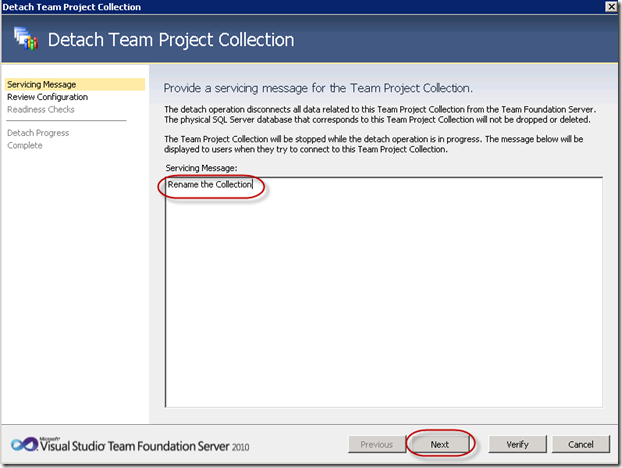</a>

b) Click on Verify

<a href="image_16.png">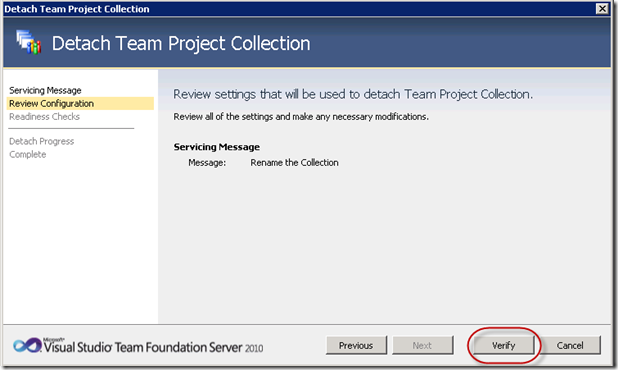</a>

c) Click on Detach, after reviewing and accepting any warnings!

<a href="image_18.png">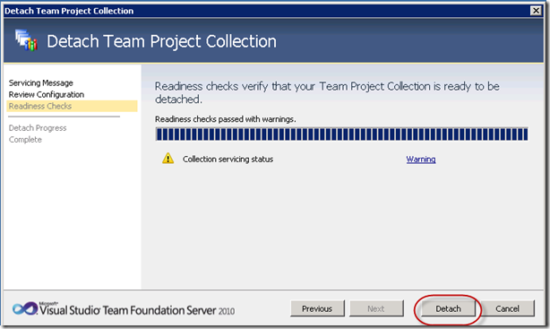</a>

The warnings in this case were:

This collection has SQL Enterprise features enabled. If you are moving the collection across SQL Server Editions please read the documentation (<a href="http://go.microsoft.com/fwlink/?LinkId=166007)">http://go.microsoft.com/fwlink/?LinkId=166007)</a> to see how this impacts you.
Some build resources are enabled. If any builds are running during the servicing operation, they will be stopped by the system.

&nbsp;

6. This has detached the Team Project Collection. It will not appear in the administration console, and you will not be able to access it.

<a href="image_22.png">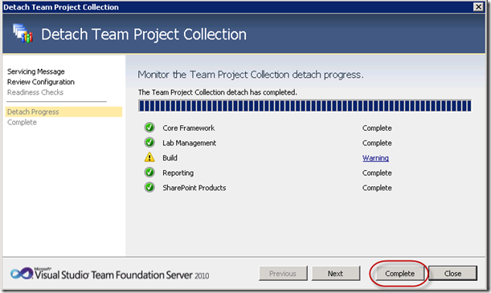</a>

The Build warnings were the disabling of the controller and the agent.

<a href="image_28.png">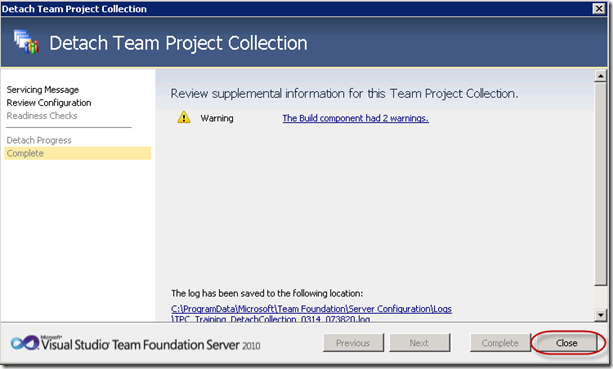</a>

<a href="image_26.png">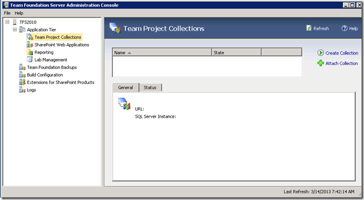</a>

7. This is an opportunity to rename the database to keep consistency. I recommend it, as it will keep the naming convention.

Open SQL Server Management Studio

Right click on the Team Project Collection database that you want to change, and click on rename

<a href="image_30.png">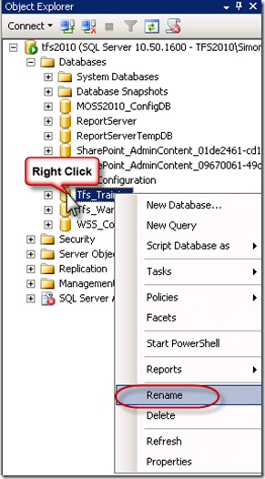</a>

Enter the new name and click Enter. By default the database name starts with TFS_, after that is the TPC name

8. Now the TPC can be re-attached, with rename

Back in the TFS Admin console, click on Attach Collection

<a href="image_34.png">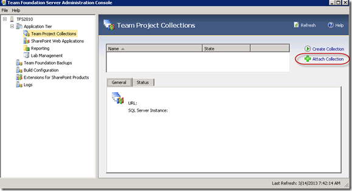</a>

9. This opens the attach wizard

a) Select the database for the Team Project Collection that you want to reattach, click Next

<a href="image_36.png">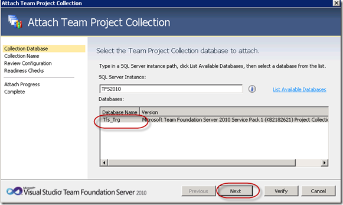</a>

b) Now we are the place that we have been working towards – renaming the Team project Collection. Enter the new name, (that should match the database) click Next

<a href="image_40.png">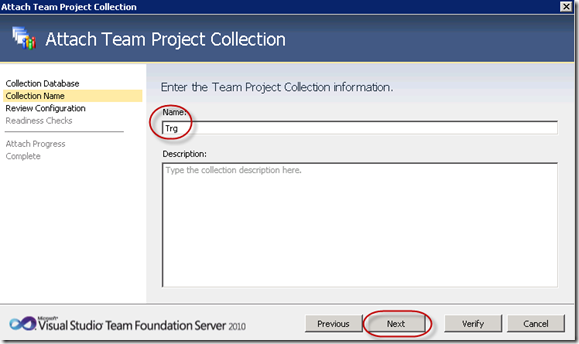</a>

c) Check what has been entered, and if it is OK click Verify

<a href="image_42.png">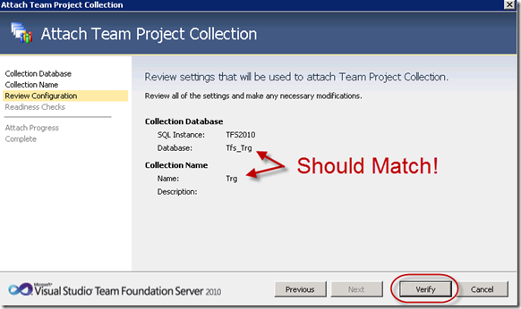</a>

d) If everything is OK, click Attach

<a href="image_44.png">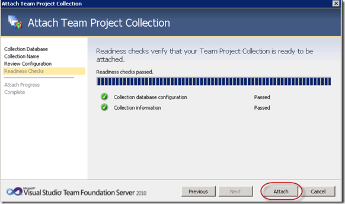</a>

e) Click Complete to see the summary (or click close to exit)

<a href="image_46.png">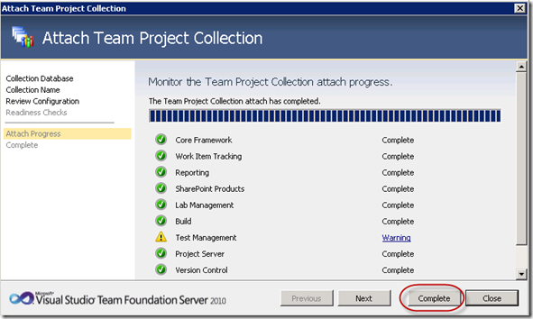</a>

View the complete results, and click close

<a href="image_48.png">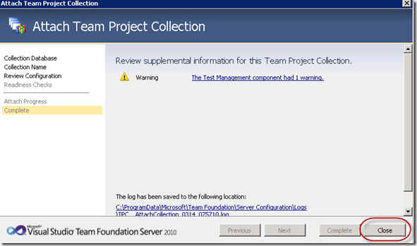</a>

9) Now it is tidy up time

a) Repoint all Build controllers and agents to the newly named Team Project Collection

b) Repoint all Test controllers and agents to the newly named Team Project Collection

c) Confirm Connectivity

d) Run a test build and test run

10) You are done – go and grab a coffee before the next task!

Technorati Tags: <a href="http://technorati.com/tags/TFS2010" rel="tag">TFS2010</a>,<a href="http://technorati.com/tags/TFS2012" rel="tag">TFS2012</a>,<a href="http://technorati.com/tags/Rename+Team+Project+Collection" rel="tag">Rename Team Project Collection</a>,<a href="http://technorati.com/tags/Hint" rel="tag">Hint</a>

