---
title: "Reporting Waste with TFS"
date: 2012-04-11T19:37:44Z
authors: ["Simon Reindl"]
slug: "reporting-waste-with-tfs"
draft: false
tags: ["Misc", "Preferred Practice", "Scrum", "TFS", "Visual Studio"]
---

---

<h1>Tracking waste in TFS</h1> <h2>Overview</h2> 
Tracking waste and gathering the empirical data is one of the most effective ways of convincing people for the need to adapt.  
This needs an Estimated Effort field, as in Scrum for Team System template.  
This can be done with the MS templates, by adding this field in.  
You need to use the estimated effort field, so that the burndown is not affected.  <h2>Steps</h2> 
Within the area path of the team project, create a top level area called waste, under that add the key waste areas as you become aware of them  
<a href="clip_image001_2.png">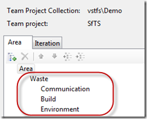</a>  
Whenever a team member encounters an issue that is causing them to lose time, they create a Task (Sprint Backlog Task in SfTS 3) and set the Area path (feature scope in SfTS 3) to be waste and the sub area if known.  
Then update the estimated effort with the amount of time lost.  
<a href="clip_image002_2.png">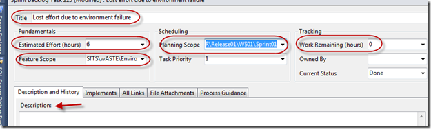</a>  
Set  
Estimated Effort = time lost  
Planning scope/Iteration Path = sprint  
Work Remaining = 0  
Feature Scope/Area Path = WasteSubArea  
Description = Meaningful comment  
Title = Meaningful Title  
Create a separate work items or update the work item as and when further waste is identified.  <h2>Reporting</h2> 
Create a new work item query, and save it with a meaningful name. I have used "Waste Query"  
<a href="clip_image003_2.png">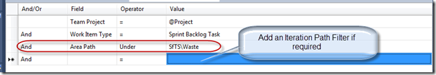</a>  
Add the columns that you want to report on, by editing the column options. I have added the Estimated Effort and Area Path columns  
<a href="clip_image004_2.png">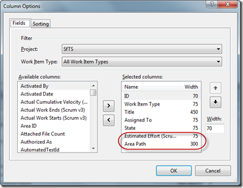</a>  
After saving the query, you can then open it up in excel and create a report with a pivot table and a chart to help create transparency regarding waste  
<a href="clip_image005_2.png">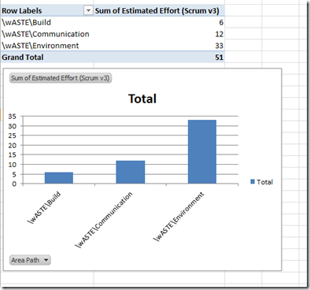</a>  <h2>Other Process Templates</h2> 
For this to work with other process templates, you will need to add in an "Estimated Effort" field to the Task work item
 
1. Get the latest version of the power tools for the version of TFS that you are using:
 
TFS11: <a title="http://visualstudiogallery.msdn.microsoft.com/27832337-62ae-4b54-9b00-98bb4fb7041a" href="http://visualstudiogallery.msdn.microsoft.com/27832337-62ae-4b54-9b00-98bb4fb7041a">http://visualstudiogallery.msdn.microsoft.com/27832337-62ae-4b54-9b00-98bb4fb7041a</a>
 
TFS2010: <a title="http://visualstudiogallery.msdn.microsoft.com/c255a1e4-04ba-4f68-8f4e-cd473d6b971f" href="http://visualstudiogallery.msdn.microsoft.com/c255a1e4-04ba-4f68-8f4e-cd473d6b971f">http://visualstudiogallery.msdn.microsoft.com/c255a1e4-04ba-4f68-8f4e-cd473d6b971f</a>
 
2. Open the Task work item from the server
 
<a href="image_2.png">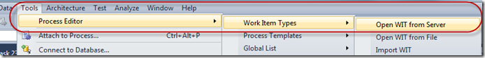</a>
 
Select the Team Project Collection, Team Project, and Work Item to edit
 
<a href="SNAGHTML1235dce.png">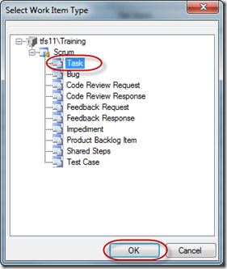</a>
 
Add a new field called Estimated Effort, with the details as below.
 
Note: The reference name must have a full stop and no spaces.
 
<a href="image_4.png">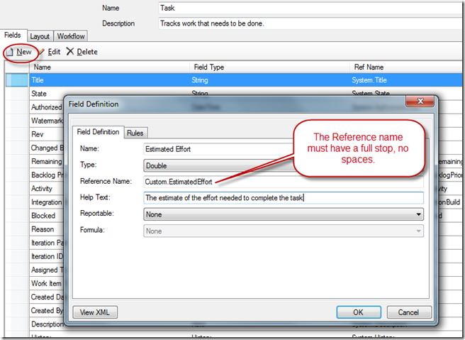</a>
 
Once that has been completed, you need to surface the new field on the Work Item Form
 
Click On the Layout tab, right click on the column to add the field to , new control
 
<a href="image_6.png">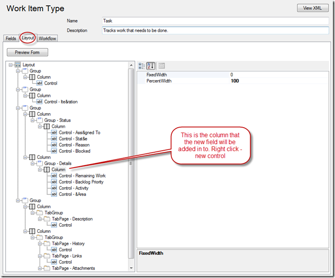</a>
 
Add the details of the new field
 
<a href="image_8.png">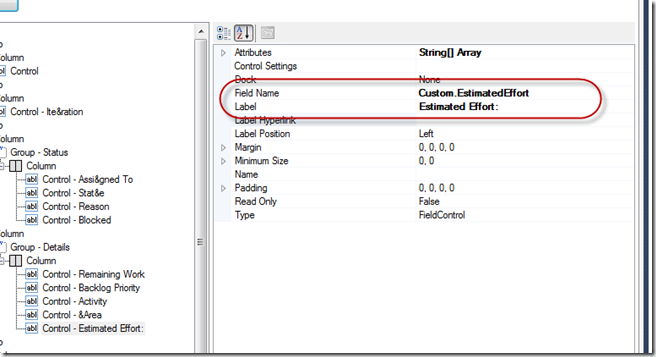</a>
 
Preview the form to check, and then save the changes.
 
Create a New Task work item to check your changes
 
<a href="image_10.png">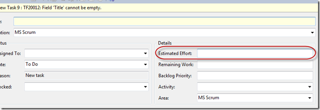</a>
 
<strong>Top Tip</strong>: get the power tools installed, and use Work Item templates to reduce the friction of creating new work items.
 
<a href="image_12.png">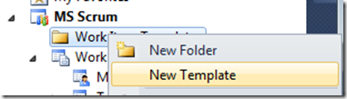</a>
 
Technorati Tags: <a href="http://technorati.com/tags/Best+Practice" rel="tag">Best Practice</a>,<a href="http://technorati.com/tags/Lean" rel="tag">Lean</a>,<a href="http://technorati.com/tags/Scrum" rel="tag">Scrum</a>,<a href="http://technorati.com/tags/TFS11" rel="tag">TFS11</a>,<a href="http://technorati.com/tags/TFS2010" rel="tag">TFS2010</a>,<a href="http://technorati.com/tags/Waste" rel="tag">Waste</a>,<a href="http://technorati.com/tags/Work+Items" rel="tag">Work Items</a>

