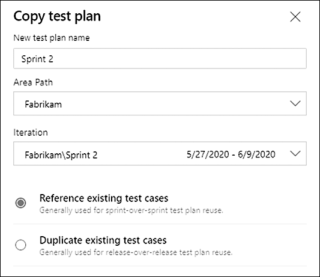
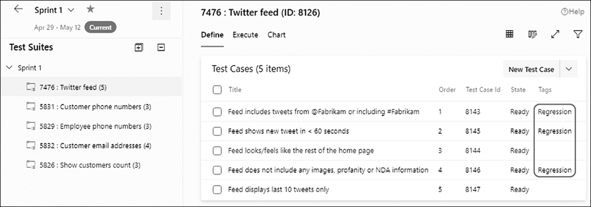

Every Sprint you build a test plan full of acceptance tests. When the Sprint ends, what should you keep, and how? Not everything deserves to outlive its Sprint, but the tests that protect your Increment absolutely do. Here's how I think about promoting tests out of a Sprint's plan and into a durable regression suite.

<strong>Reuse a test, or truly copy it</strong>

By design, a single Test Case work item can be associated with multiple PBIs. If you've got a generic test, say, verifying that a page request returns a response in 5 seconds or less, you can reuse it simply by adding that existing Test Case work item to another suite. Just know the catch: if you tweak it for the current Sprint, like changing 5 seconds to 3, that change affects every instance of that test case. It's a reference, not a copy.

When you need independence, Microsoft gives you a true copy. You can copy individual test cases, specifying the destination project, plan, and suite. You can also copy an entire test plan, including its suites and cases, and choose to either reference the existing test cases or make deep copies of them.

<figure class="wp-block-image size-large has-custom-border"></figure>

One word of caution. It's a smell when I see Developers repeatedly using the Copy Test Plan feature. Maybe their testing really is similar Sprint to Sprint, but it could also mean they're carrying over unfinished PBIs. Ideally a new Sprint is all new PBIs with all new criteria requiring all new tests, so there's nothing to copy.

<strong>Building the regression suite</strong>

Regression testing is rerunning acceptance tests for done PBIs to ensure the Increment still meets the <a href="https://scrumguides.org/" target="_blank" rel="noopener">Definition of Done</a> and stays releasable. The hard part is deciding which of your hundreds of test cases to include. Good candidates cover brittle areas, high technical debt, and core or critical functionality.

Once you've identified them, the mechanics are simple. Edit each Test Case work item and add a "Regression" tag. If you have multiple types, use distinct tags like "Regression-UI" or "Regression-Financial."

<figure class="wp-block-image size-large has-custom-border"></figure>

Then make them visible in the new Sprint's plan with a Query-based suite that shows all Test Case work items containing the "Regression" tag. From then on, adding or removing a test from regression is just adding or removing the tag. One downside: the query is dynamic, so there's no history of which tests applied to which Sprint. If you need a static record, create a Static suite and manually add those test cases before closing the Sprint.

Tag late while context is fresh, query to surface them, snapshot if you need the history. That's a regression suite that protects your Increment without slowing you down.

