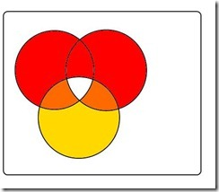
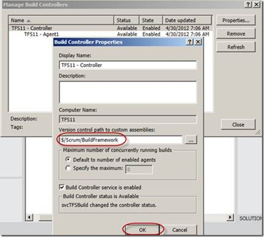
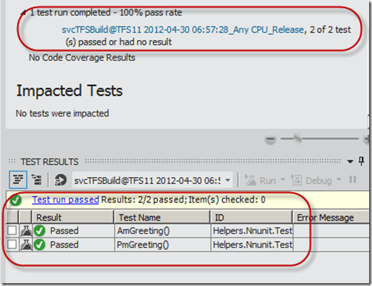

---
title: "Running nUnit in a TFS11 build on 64 bit server"
date: 2012-04-30T07:40:39Z
authors: ["Simon Reindl"]
slug: "running-nunit-in-a-tfs11-build-on-64-bit-server"
draft: false
tags: ["Development", "TFS", "Visual Studio", "ALM"]
---

---

<h3>Overview</h3>
In TFS/VS 11, frameworks other than MS Test are supported, which is cool. Peter Provost mentions them <a href="http://www.peterprovost.org/blog/2012/02/29/Visual-Studio-11-Beta-Unit-Testing-Plugins-List/" target="_blank" rel="noopener noreferrer">here</a>.

OK, so you start to use this great new feature, queue up a team build and the tests aren’t run.

Assem Bansal has a great article <a href="http://blogs.msdn.com/b/aseemb/archive/2012/03/03/how-to-make-your-discoverer-executor-extension-visible-to-ute.aspx" target="_blank" rel="noopener noreferrer">here</a>, so you do that, and no tests are run either. Confusing. The issue is that the 64 bit version is not picking up the reference to the test extension even when it is installed. Hey, it is a beta!

The steps to correct this are below, which I picked up from <a href="http://www.codewrecks.com/blog/index.php/about/">Ricci Gian Maria</a> <a href="http://www.codewrecks.com/blog/index.php/2012/03/05/running-nunit-and-xunit-tests-in-tfs11-build/" target="_blank" rel="noopener noreferrer">here</a>.

I put the steps in a checklist to make it easier for me to follow.
<table border="1" cellspacing="0" cellpadding="0">
<tbody>
<tr>
<td valign="top" width="53"><b>Step</b></td>
<td valign="top" width="560"><b>Description</b></td>
</tr>
<tr>
<td valign="top" width="53"><b>1</b></td>
<td valign="top" width="560">Log on locally to the build server</td>
</tr>
<tr>
<td valign="top" width="53"><b>2</b></td>
<td valign="top" width="560">Install the nUnit test runner extension

<a href="http://visualstudiogallery.msdn.microsoft.com/6ab922d0-21c0-4f06-ab5f-4ecd1fe7175d">http://visualstudiogallery.msdn.microsoft.com/6ab922d0-21c0-4f06-ab5f-4ecd1fe7175d</a></td>
</tr>
<tr>
<td valign="top" width="53"><b>3</b></td>
<td valign="top" width="560">Run the download, and the extension will be installed</td>
</tr>
<tr>
<td valign="top" width="53"><b>4</b></td>
<td valign="top" width="560">Open windows explorer, and navigate to the users folder for the account that you are logged in as</td>
</tr>
<tr>
<td valign="top" width="53"><b>5</b>

&nbsp;</td>
<td valign="top" width="560">Copy all the nUnit assemblies from the nUnit extension (you will have to browse them until you see the four listed below.

They will be in C:Users&lt;UserName&gt;AppDataLocalMicrosoftVisualStudio11.0Extensions&lt;Extension Folder&gt;

</td>
</tr>
<tr>
<td valign="top" width="53"><b>6</b></td>
<td valign="top" width="560">Add them to a location in version control

If you are doing a lot of build customisation (you probably will be - eventually :) ), it is best practice to have a team project for the extension assemblies as well as the customised build templates

</td>
</tr>
<tr>
<td valign="top" width="53"><b>7</b></td>
<td valign="top" width="560">Add the version control reference to the build controller

Build menu - manage Build Controllers - Properties; Set the Version control path to custom assemblies to the location created in step 6.

</td>
</tr>
<tr>
<td valign="top" width="53"><b>8</b></td>
<td valign="top" width="560">Queue the build with a solution containing nUnit tests</td>
</tr>
<tr>
<td valign="top" width="53"><b>9</b></td>
<td valign="top" width="560">The tests are run, and the data is stored in TFS

</td>
</tr>
</tbody>
</table>
And now the tests are in the build. Awesome.

Technorati Tags: <a href="http://technorati.com/tags/TFS11" rel="tag">TFS11</a>,<a href="http://technorati.com/tags/Build" rel="tag">Build</a>,<a href="http://technorati.com/tags/64Bit" rel="tag">64Bit</a>,<a href="http://technorati.com/tags/nUnit" rel="tag">nUnit</a>,<a href="http://technorati.com/tags/Unit+Testing" rel="tag">Unit Testing</a>

