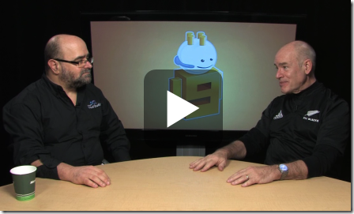

<a href="http://www.scrum.org" target="_blank" rel="noopener">Ken Schwaber</a>, co-inventor of Scrum, and Sam Guckenheimer, Group Product Planner for Visual Studio discuss the <a href="http://www.scrum.org/scrumdeveloper" target="_blank" rel="noopener">Professional Scrum Developer</a> (PSD) program around Visual Studio 2010. PSD includes a unique and intensive five-day experience for software developers. The <a href="http://scrum.accentient.com" target="_blank" rel="noopener">course</a> guides teams on how to turn product requirements into potentially shippable increments of software using Visual Studio 2010, the Scrum framework, and modern software engineering practices.
 
 
 
Here are the direct links to the videos:
 <ul> <li>The <a href="http://channel9.msdn.com/posts/Charles/Pro-Scrum-Developer-Intro" target="_blank" rel="noopener">short video</a> (7 minutes)</li> <li>The <a href="http://channel9.msdn.com/posts/Charles/Ken-Schwaber-and-and-Sam-Guckenheimer-Professional-Scrum-Development" target="_blank" rel="noopener">longer video</a> (44 minutes)</li></ul>