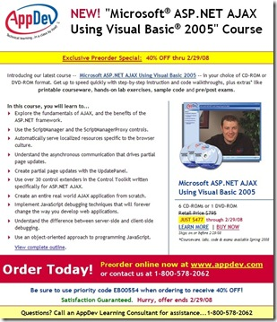

I just got sent this announcement from <a href="http://www.appdev.com" target="_blank" rel="noopener">AppDev</a> . I was about to delete it when I noticed a familiar looking face of my friend (and second-time, new dad) <a title="Scott Cate's Blog" href="http://www.scottcate.com/" target="_blank" rel="noopener">Scott Cate</a>!
