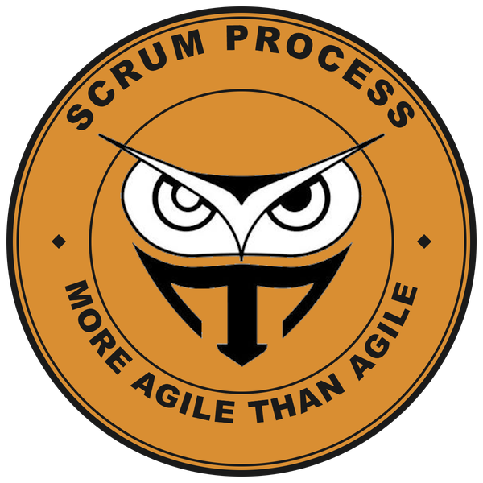

When you create a new project in Azure DevOps, you pick a <a href="https://learn.microsoft.com/en-us/azure/devops/boards/work-items/guidance/choose-process" target="_blank" rel="noopener">process</a>: Basic, Agile, Scrum, or CMMI. Most organizations pick Agile. Not because they evaluated it, but because of the name. It sounds like the safe, modern choice, and it has a "User Story" work item type, which is what everyone thinks they're supposed to want. I'd like to talk you out of it.

Full disclosure: I helped create the Scrum process back in 2010. It has drifted from the <a href="https://scrumguides.org/" target="_blank" rel="noopener">Scrum Guide</a> over the years, and I wrote about <a href="/blog/customizing-a-professional-scrum-process-in-azure-boards/">fixing that drift</a>, but it is still the simplest and most agile of the system processes. More agile than the one named Agile.

<figure class="wp-block-image"></figure>

<strong>Look at the states</strong>

A User Story in the Agile process moves through New, Active, Resolved, and Closed. Stop at Resolved for a minute. What does it mean? It means a developer finished coding and the work is now waiting for someone else, usually a tester, to verify it and close it. Resolved isn't a state of the work. It's a handoff. It's a queue with a label on it.

That queue is inherited. The Agile process descends from the old <a href="https://en.wikipedia.org/wiki/Microsoft_Solutions_Framework" target="_blank" rel="noopener">MSF</a> for Agile Software Development template, from an era when programmers programmed, testers tested, and work items shuttled between them like interoffice mail. Resolved is the envelope. It's a small waterfall baked right into the workflow, and every team that picks Agile inherits it on day one whether they have a separate test group or not.

Scrum has a better word: <strong>Done</strong>. One word, one shared quality bar, owned by the whole team. A Product Backlog Item is New, Approved, Committed, or Done. Nothing is waiting on anyone. Either the Developers have met the Definition of Done or they haven't.

Side note: I prefer Ready over Approved for that second state, because many teams have a Definition of Ready and the state should say so. I also rename Committed to Forecasted, which aligns with the Scrum Guide and puts some distance between the team and the horrible word commitment. Both are changes I make when <a href="/blog/customizing-a-professional-scrum-process-in-azure-boards/">customizing the Scrum process</a>.

In 30 years of working with software teams, I've met plenty with a Definition of Done. I have never met one with a Definition of Resolved, let alone a Definition of Closed. If nobody can tell you what a state means, it's not a state your team needs.

<strong>The simplicity carries through</strong>

It's not just the requirement states. A Scrum Task tracks one number, Remaining Work. That's all a self-managing team needs to see whether the Sprint is on track. An Agile Task tracks Original Estimate, Remaining Work, and Completed Work. Two of those three fields exist to feed reports that compare what you guessed to what you spent, which is exactly the kind of report nobody should be running on a self-managing team. Estimates are for forecasting, not for grading.

Fewer fields means less to fill in, less to argue about, and less to customize away later. Every field you don't have is a field nobody can turn into a required field, or a metric that can be used to punish.

<strong>You don't have to call it Scrum</strong>

I hear this one a lot: "We're not doing Scrum, so we shouldn't pick the Scrum process." Fair enough, but look at what your team actually does. If you pull from an ordered backlog, work in iterations, and finish work against a shared quality bar, your practice mimics Scrum whether you use the vocabulary or not. The Scrum process models that reality: work is either not started, in progress, or done. That's it.

And if the words bother you, change them. Azure Boards lets you create an inherited process, add a work item type named User Story, and disable the Product Backlog Item. Ten minutes, tops. You keep the clean workflow and lose the vocabulary you didn't want. What you can't easily do is go the other direction, because Resolved isn't a naming problem. It's a workflow problem, and teams end up hiding it with board columns or removing it in a custom process anyway.

Next time you create a project, pick Scrum. Your Definition of Done will thank you.

