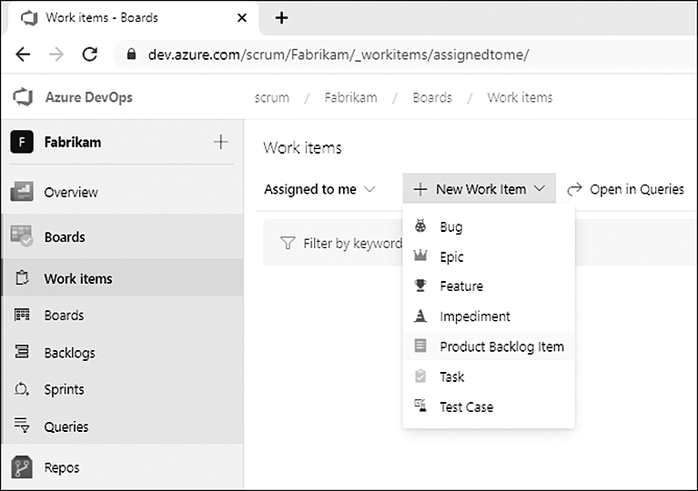

Azure DevOps offers more than a dozen work item types, but most don't relate to planning and managing work. In the Scrum process, the ones that actually matter for a Scrum Team are Product Backlog Item, Bug, Task, Impediment, Epic, and Feature. Here's what each is for, and which ones teams tend to misuse.

<figure class="wp-block-image size-large has-custom-border"></figure>

<strong>Product Backlog Item</strong>

The PBI is the heart of the Scrum process. It captures requirements with the least documentation necessary, and only the title is required. As detail emerges, you add value, acceptance criteria, and a size. A PBI moves through New, Approved, Committed, Done. This is the work item type a Scrum Team should be living in.

<strong>Bug</strong>

A Bug communicates that a problem exists in the product. In <a href="https://scrumguides.org/" target="_blank" rel="noopener">Scrum</a>, a bug is just a type of PBI, but Azure Boards gives it a separate type so it can track defect-specific fields like severity, repro steps, and build numbers. Here's the misuse: a bug is not a failed test. A failed test just means the team isn't done yet. Many teams I work with skip the Bug type entirely, track bugs as PBIs, and tag them "Bug" so the Product Backlog holds one consistent type with Value and Size for ROI.

<strong>Task</strong>

A Task is a piece of detailed work the Developers must do to develop a PBI. Tasks form the Sprint plan and, with their PBIs, constitute the Sprint Backlog. The classic misuse is creating tasks before Sprint Planning, which is waste. Another is using the Activity field, since everything a Professional Scrum Team does is a development activity.

<strong>Impediment</strong>

An Impediment reports anything that blocks the team from achieving the Sprint Goal. It's Open or Closed, nothing more. Teams confuse impediments with tasks: tasks are the plan for the work, impediments are unplanned obstacles to it. And don't assume the Scrum Master always owns them. Better still, remove impediments rather than track them.

<strong>Epic and Feature</strong>

These two exist to support hierarchical backlogs. An Epic is a big-picture business initiative; a Feature is a releasable component. The Scrum Guide mentions neither, only Product Backlog items, and Microsoft added them in 2014 to support scaled agile. They're fine for organizing and visualizing work across levels, but the misuse is treating them like extra ceremony. Developers never directly forecast a Feature or Epic; they're containers, and their state moves to Done when the last related child is done.

Know what each type is for, use the few you need, and tag the rest of the noise out of your life. Sounds like good Scrum to me.

