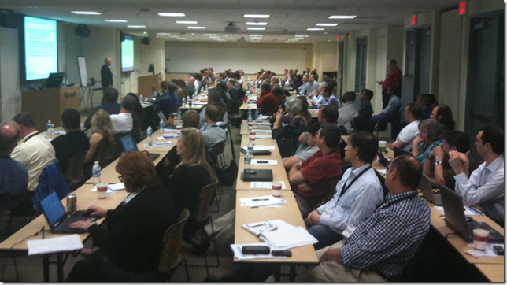
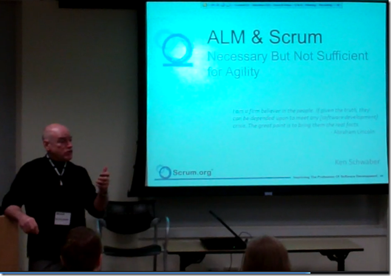

---
title: "Scrumming in DC"
date: 2011-05-02T11:17:14Z
authors: ["Richard Hundhausen"]
slug: "scrumming-in-dc"
draft: false
tags: ["Conferences", "Scrum", "Visual Studio"]
---

---

Actually at <a href="http://www.microsoft.com/en-us/mtc/locations/reston.aspx" target="_blank" rel="noopener">Microsoft’s MTC in Reston, Virginia</a>, but close enough.
 
Thanks to everyone who attended our event, either online or in-person, last week. It was great to have such a large group that was so interested in Scrum and Visual Studio’s ability to enact it. We had some great discussions, questions, and real-world examples.
 

 
Here are some links to materials from the event:
 <ul> <li><a href="Schwaber-Reston.pdf" target="_blank" rel="noopener">Ken Schwaber’s slide deck</a></li> <li><a href="VS2010Scrum-Reston.pdf" target="_blank" rel="noopener">Richard Hundhausen’s slide deck</a></li> <li><a href="VS2010Scrum-Reston.zip" target="_blank" rel="noopener">Richard Hundhausen’s demo files &amp; bookmarks</a></li></ul> 

 
Also, here are a couple of small videos from the event:
 <ul> <li><a href="VS2010Scrum-Reston-Audience.wmv" target="_blank" rel="noopener">Some of the event attendees</a></li> <li><a href="VS2010Scrum-Reston-Schwaber.wmv" target="_blank" rel="noopener">Ken delivering software in 30 days</a></li></ul>
