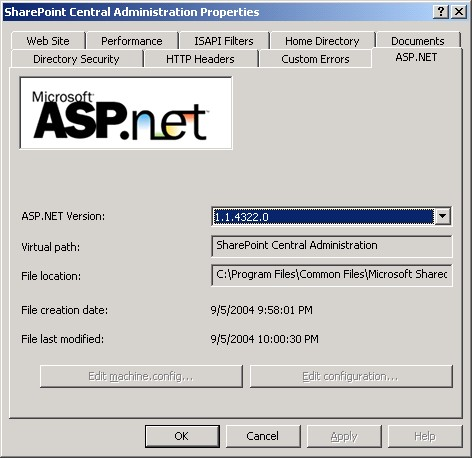
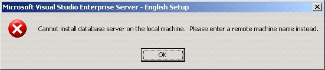

Wish me luck -- I'm off to install the Client/App/Data components to VSTS TFS in *one* VHD image.

My first snag, was seeing a weird <em>!"ValueType mismatch"</em> error that I couldn't explain, so I did some research. Well, now that IIS 6.0 now has 1.1 and 2.0 versions of the framework, and Sharepoint doesn't work, until you set both of the sites back to version 1.1. Do a restart of the server too, for good measure.

The next speed bump occurred when I was actually installing the software, and specified my local machine as being the database server, at which point I was presented with&nbsp;a dialog reading &#8220;Cannot install database server on the local machine. Please enter a remote machine name instead&#8220;:

The workaround was to specify 127.0.0.1 as the name of the server, rather than RESEARCH (my local machine name)