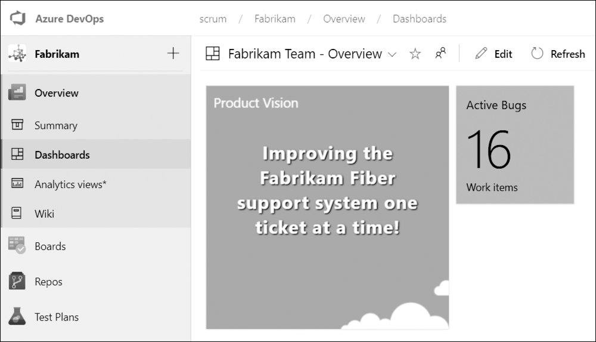

Work item queries are one of the most underused features in Azure Boards. They let you view, filter, and sort your work so you can decide what to act on, and they can power charts on dashboards and wiki pages. When you save a query to Shared Queries instead of My Queries, everyone with access to the project can run it. A few well-chosen shared queries can quietly keep a Scrum Team honest.

<figure class="wp-block-image size-large has-custom-border"></figure>

Here are the ones I'd create first. Most of them aren't about reporting. They're about surfacing smells.

<strong>Health of the Product Backlog</strong>

<ul>
  <li><strong>Open impediments.</strong> The whole team, and especially the Scrum Master, should keep an eye on these. Surface them on a dashboard or wiki page so they don't get lost.</li>
  <li><strong>PBIs assigned to someone other than the Product Owner.</strong> In Scrum the Product Owner owns the Product Backlog items, not individual Developers. Empty assigned-to values are fine; a Developer's name on a backlog item is a smell.</li>
  <li><strong>New or approved PBIs with tasks.</strong> It's wasteful to create tasks ahead of Sprint Planning. This query finds the items where someone got ahead of themselves.</li>
  <li><strong>Approved PBIs without acceptance criteria.</strong> If a PBI is approved but has no acceptance criteria, how will the team know what the expectations are or when development is done?</li>
</ul>

<strong>Hierarchy hygiene</strong>

If you use Epic and Feature work items, a couple of structural queries help you spot orphans before they bite.

<ul>
  <li><strong>Features without links to epics.</strong> Assuming you're using epics, it's useful to see the unparented features.</li>
  <li><strong>Features without links to PBIs.</strong> Assuming you're using features, it's useful to see the ones with no children, because a feature with nothing under it usually means refinement stalled.</li>
</ul>

None of these queries scold anyone. They just make reality transparent. A team member runs the impediments query during the Daily Scrum, the Product Owner runs the assigned-to query before refinement, and the Scrum Master glances at the "tasks created too early" query before Sprint Planning. The smell shows up before it becomes a habit.

A small warning, because transparency cuts both ways. A query is information, not a weapon. The goal is to help the team self-manage, not to give anyone a stick to wave at individuals. Use these in the spirit of inspection and adaptation, surface them where the team can see them, and let the team decide what to do about what they find.

Save them to Shared Queries, organize them in a folder, and you've built yourself a lightweight checklist that runs itself. Sounds like good Scrum to me.

