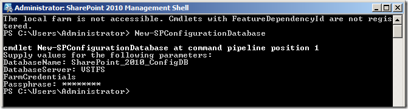
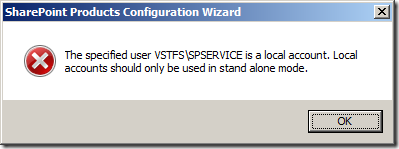
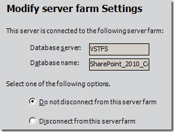

---
title: "SharePoint Foundation 2010 using local accounts"
date: 2012-03-12T03:49:45Z
authors: ["Richard Hundhausen"]
slug: "sharepoint-foundation-2010-using-local-accounts"
draft: false
tags: ["TFS", "Microsoft"]
---

---

 
When configuring Team Foundation Server 11, the default action is to install and configure SharePoint Foundation 2010. I think this is great. I really love SharePoint 2010, and am glad that Microsoft opted to install the newer version automatically, rather than WSS3 like it did previously. Keep in mind that WSS3 will still work with TFS11 and even has a smaller RAM requirement as well.
 
After installing the SharePoint prerequisites, I proceeded to the installation and then to the configuration wizard. When I got to the step where I was asked to specify the Database Access Account, I assumed my local windows account would work fine. In fact, if you read the fine print below it says "If your configuration database is hosted on another server, you must specify a domain account". Mine’s not. I’m creating a VM with an all-up image to be used in an environment that doesn’t have a domain.
 

 
But SharePoint wasn’t having it. I got the message that The specified user VSTFSSPSERVICE is a local account. Local accounts should only be used in stand alone mode:
 

 
This messages makes it a bit more clear, but since this guidance contradicts the <a href="http://msdn.microsoft.com/en-us/library/dd578615(v=vs.110).aspx" target="_blank" rel="noopener">TFS guidance</a> I’m following in the <a href="http://www.microsoft.com/download/en/details.aspx?id=29035" target="_blank" rel="noopener">TFS11 installation guide</a>, I needed to find another way. Fortunately, I found this Microsoft <a href="http://sharepoint.microsoft.com/blogs/fromthefield/Lists/Posts/Post.aspx?ID=112" target="_blank" rel="noopener">workaround</a> posted by Neil "The Doc" Hodgkinson. Here are the steps from that I followed:
 <ol> <li>Canceled out of the the configuration wizard.  <li>Launched the SharePoint 2010 Management Shell.  <li>Ran <u>New-SPConfigurationDatabase</u>.  <li>Entered <u>SharePoint_2010_ConfigDB</u> for the DatabaseName.  <li>Entered <u>VSTFS</u> for the DatabaseServer.  <li>Entered the username and password for the Database Access Account into the dialog. Note: this account is also known as the server farm account and requires <a href="http://technet.microsoft.com/en-us/library/cc288210.aspx" target="_blank" rel="noopener">certain permissions</a>.  <li>Entered a valid passphrase.</li></ol> 
After a few moments, SharePoint created the a new configuration database and an admin content database for me:
 

 
Next, I launched the SharePoint 2010 Products Configuration Wizard again and it picked up right where I would expect it to:
 

 
#ProblemSolved

