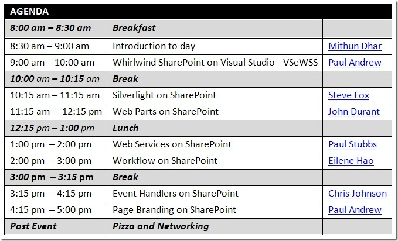

In typical FireStarter event style, this event will be delivering a first class experience to all attendees and make them experts on developing on SharePoint technologies before the end of the event. There should be great speakers from the Microsoft roster presenting some awesome topics that will help you build and customize web sites with SharePoint and Web 2.0 technologies. 
&nbsp; 
  
<u><strong> Logistics</strong></u> 
 Where: Microsoft Conference Center (Building 33) – Kodiak Room 
 
When: June 11th 2008 - Wednesday 
 
Free stuff: Breakfast and lunch provided, lots of swag 
 
<u><strong>Attending</strong></u>
 
<a href="http://msevents.microsoft.com/CUI/EventDetail.aspx?EventID=1032379380&amp;culture=en-US">Click here to register to attend In-person</a>&nbsp; 
<a href="http://msevents.microsoft.com/CUI/WebCastEventDetails.aspx?EventID=1032380419&amp;EventCategory=2&amp;culture=en-US&amp;CountryCode=US">Click here to attend via Live Meeting!</a> (the in-person event will have a better experience) 
 If you have any questions, please contact <a href="mailto:mithund@microsoft.com" target="_blank" rel="noopener">Mithun</a>.
