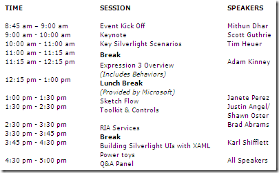

Microsoft is hosting a Silverlight 3.0 Fire Starter event in Redmond, WA on the 17th of September. The event has a spectacular speaker line-up with Scott Guthrie keynoting the event followed by Tim Heuer, Adam Kinney, Karl Shifflett among many other rock stars. The entire event will also be broadcasted online via Live Meeting.  
&nbsp; 
   <a href="http://msevents.microsoft.com/CUI/EventDetail.aspx?EventID=1032422412&amp;Culture=en-US" target="_blank" rel="noopener">Register for the Live Event</a> | <a href="http://msevents.microsoft.com/CUI/WebCastEventDetails.aspx?EventID=1032423163&amp;EventCategory=2&amp;culture=en-US&amp;CountryCode=US" target="_blank" rel="noopener">Register for the Live Webcast</a> | <a href="http://www.msdnevents.com/firestarter" target="_blank" rel="noopener">Visit the site</a> | or Call 1-877-MSEVENT