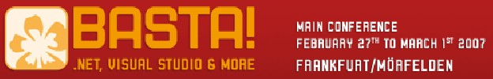

If you've got some extra miles burning a hole in your account, cash them in to get to Frankfurt, Germany at the end of February and attend <a href="http://www.basta.net/" target="none" rel="noopener">Basta!</a>

Surprise ... I'll be speaking on Team System at the conference!

<ul>
<li><a href="http://www.basta.net/sessions_eng.asp?track=14#session-vst1" target="none" rel="noopener">VSTS Best Practices (part 1)</a></li>
<li><a href="http://www.basta.net/sessions_eng.asp?track=14#session-vst2" target="none" rel="noopener">VSTS Best Practices (part 2)</a></li>
<li><a href="http://www.basta.net/sessions_eng.asp?track=14#session-vst6" target="none" rel="noopener">Customizing and Extending DB/Pro Edition</a></li>
<li><a href="http://www.basta.net/sessions.asp?track=16#session-wf1" target="none" rel="noopener">From Zero to Team System (in 5 days)</a></li></ul>
Hope to see you there!