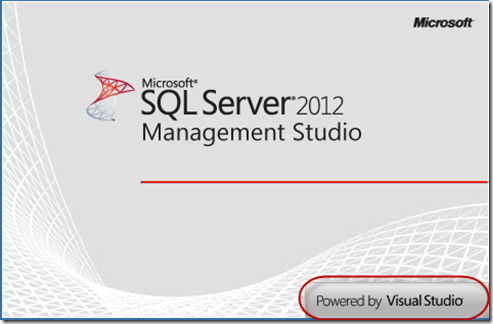

---
title: "SQL 2012 powered by Visual Studio"
date: 2012-03-15T07:26:24Z
authors: ["Simon Reindl"]
slug: "sql-2012-powered-by-visual-studio"
draft: false
tags: ["Misc", "Visual Studio", "SQL Server"]
---

---

In case you hadn’t seen it, SQL Management Studio 2012 is now a Visual Studio powered tool.
 
 
Technorati Tags: <a href="http://technorati.com/tags/Visual+Studio" rel="tag">Visual Studio</a>,<a href="http://technorati.com/tags/SQL2012" rel="tag">SQL2012</a>,<a href="http://technorati.com/tags/IDE" rel="tag">IDE</a>

 
Nice…

