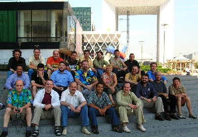

Our Train-The-Trainer (TTT) event has come to a close, and what a great class it was! We had 26 students, from Saudi Arabia, Egypt, Kuwait, Denmark, Italy, the Russian Federation, Finland, Belgium, Macedonia, Greece, Poland, Lithuania, and France.
