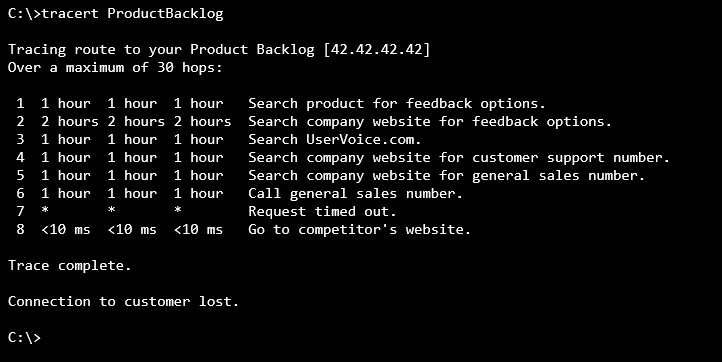

---
title: "Stakeholder Traceroute"
date: 2016-06-13T14:09:43Z
author: "Richard Hundhausen"
slug: "stakeholder-traceroute"
draft: false
tags: ["Azure DevOps", "Misc", "Scrum", "TFS"]
---

---

I'm always amazed at how difficult and even impossible it can be for stakeholders to get their ideas into some product backlogs.

I've started asking teams to run a stakeholder <a href="https://en.wikipedia.org/wiki/Traceroute" target="_blank" rel="noopener">traceroute</a>. In other words, walk me through the process that a user might go through in order to get a good idea (not necessarily a bug) in front of the Product Owner. Here is an example ...

The good news is that I still meet teams who value their stakeholder's opinions and will give them (near) direct access to their product backlog. Oh, and if you are using Microsoft Team Foundation Server or Team Services, <a href="https://www.visualstudio.com/en-us/products/visual-studio-team-services-pricing-vs.aspx" target="_blank" rel="noopener">you can add as many stakeholders as you want. Free</a>.
