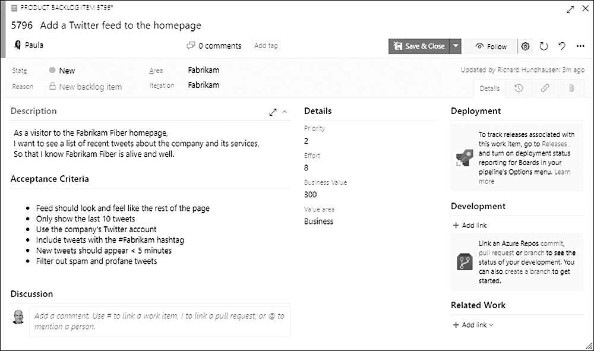

Open a PBI work item form in the Scrum process and you'll find a field called Value Area with two options: Business and Architectural. It looks helpful. It isn't. I'd leave it alone.

<figure class="wp-block-image size-large has-custom-border"></figure>

The problem starts with the premise. A Product Backlog Item can have value for any number of reasons, well beyond the two choices in that drop-down. Forcing every item into Business or Architectural pretends the world is simpler than it is, and the pretense costs you more than it gives.

<strong>Architectural work rarely has direct value</strong>

Here's where the field really gets teams into trouble. Mark something Architectural and you've quietly told everyone it carries value on its own. It usually doesn't. Architectural work is required to deliver the kind of value a stakeholder is looking for, but it's rarely of direct value itself. It enables value. It isn't the value.

That distinction matters because a stakeholder doesn't experience your message bus or your refactored data layer. They experience the feature those things make possible. When the tool invites you to label architecture as a separate category of value, it encourages the team to treat plumbing as an end in itself, and to defend it on the backlog as though it competes with features on equal footing. It doesn't.

<strong>One value scale for everything</strong>

The cleaner approach is to not use the Value Area field at all. When you stop carving items into two value buckets, every item on the Product Backlog can be measured against the same stratification of value, the value as perceived by stakeholders. That's the only value that counts in <a href="https://scrumguides.org/" target="_blank" rel="noopener">Scrum</a>.

With a single value measure, your Product Owner can actually compare items. Pair Business Value with Effort and you get a usable read on ROI across the whole backlog, where value is the return and effort is the investment. You can't do that cleanly when half your items have been shunted into an "architectural" lane that the value math doesn't know how to handle.

If a chunk of architecture genuinely needs doing, express it as a PBI whose value reflects what it ultimately enables, and let it earn its place in the order on the same terms as everything else. Make the Product Owner decide where it sits relative to the features, not next to them in a parallel universe.

So skip the Value Area field. Better yet, if you've created an inherited process, hide it. One product, one Product Backlog, one measure of value. Sounds like good Scrum to me.

