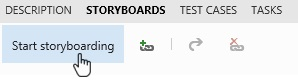

---
title: "Storyboard your ideas for free"
date: 2015-12-15T10:01:47Z
author: "Richard Hundhausen"
slug: "storyboard-your-ideas-in-powerpoint-for-free-now"
draft: false
tags: ["Azure DevOps", "TFS", "Visual Studio"]
---

---

<strong>Update </strong>(April 2016): Microsoft has released <a href="https://www.microsoft.com/en-us/download/details.aspx?id=51641" target="_blank" rel="noopener noreferrer">Office Integration 2015 Update 2</a>.

With the recent release of Team Foundation Server <a href="https://www.visualstudio.com/en-us/news/tfs2015-update1-vs.aspx" target="_blank" rel="noopener noreferrer">Update 1</a>, Microsoft has enabled all users to <a href="https://msdn.microsoft.com/en-us/Library/vs/alm/Work/office/storyboard-your-ideas-using-powerpoint" target="_blank" rel="noopener noreferrer">create storyboards in PowerPoint</a> for free. This means that even stakeholders (VSTS/TFS users that don't need a license) can now also create storyboards in PowerPoint without a Visual Studio license as well.

This capability is provided by the Team Foundation Server Office Integration 2015 Update 1, which includes a standalone Office integration installer that provides Excel integration, Project integration, and the PowerPoint-based storyboarding tool.

Here are the steps to make this happen:
<ol>
 	<li><a href="https://msdn.microsoft.com/en-us/library/bb558971.aspx" target="_blank" rel="noopener noreferrer">Add the user to the team project</a>.</li>
 	<li><a href="https://msdn.microsoft.com/en-us/Library/vs/alm/Work/connect/work-as-a-stakeholder" target="_blank" rel="noopener noreferrer">Make that user a stakeholder</a>.</li>
 	<li>Install PowerPoint 2007 or later.</li>
 	<li><a href="https://www.microsoft.com/en-us/download/details.aspx?id=49992" target="_blank" rel="noopener noreferrer">Install TFS Office Integration 2015 Update 1</a>.</li>
</ol>

Happy storyboarding, but remember these two <a href="http://agilemanifesto.org/" target="_blank" rel="noopener noreferrer">agile values</a>: "individuals and interactions over process and tools" and "working software over comprehensive documentation"
