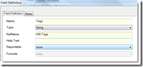
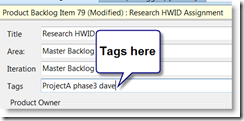
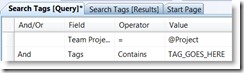
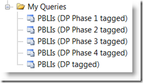

I expect some people to see this and say, "Hey, that's clever." I know that others will read this and think, "What a hack."

Whichever side you fall on, there is little debate that navigating Work Items in Team System via customizable queries can be a little frustrating at times. The rub is in the data matching and ensuring you have fields defined for all the data you want. Often, I want to work with a set of work items that seem to have little to do with each other and aren't tied together with a genuine data model.

For example, when my backlog of Product Backlog Items (PBLIs) has 300 work items in it, I want to take 5 of them into an estimation meeting. Or maybe I want to flag 10 of them as a group because they are related via a project that I cannot get to with Area or Iteration data.

The logical next question is, "Wouldn't it be great if I could tag a work item in TFS?"

Here's how I did it.
<ol>
	<li>Add a custom field to every single Work Item type in my Team Project.

This field is just a string and is not marked as reportable. I only need it available for queries. I added no custom rules for the field, it is just there if you want it, not required or managed as part of workflow.</li>
	<li>Add a control (a long one) for the field on all the work item types. I put it right near the top to make it easy.
</li>
	<li>Tag away. As a best practice, I am advising users to treat space as a delimiter to make tag searching easier.</li>
	<li>Create a custom team query that looks like this:

This lets users get to a search fairly quickly inside VS, but the best thing is to create your own private tag searches and keep them around like this:
</li>
	<li>It  is much easier to get use out of this using Team System Web Access because the search feature will simply hit against tags.</li>
</ol>