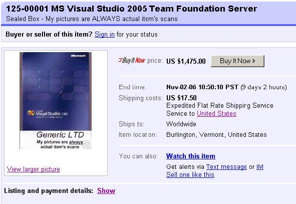
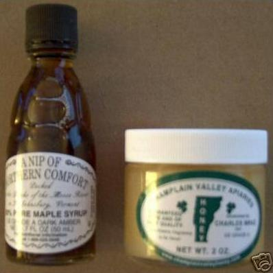

EBay always makes me laugh. What some people will do to sell their product!

Take this example of an <a href="http://cgi.ebay.com/ws/eBayISAPI.dll?ViewItem&amp;item=280041247616" target="none" rel="noopener">auction</a> for Team Foundation Server ...

Look what the seller is throwing in to "sweeten" the deal ...
"USA Customers get FREE Maple Syrup and Crystallized Honey samples from Vermont. USA Customers get one 1.7 oz. sample of 100% Proof Grade A Maple Syrup from Maple Grove Farms and one 2 oz. sample of Grade A Crystallized Honey from Champlain Valley Apiaries."

