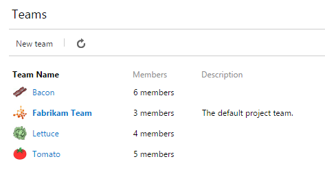
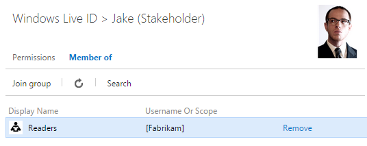
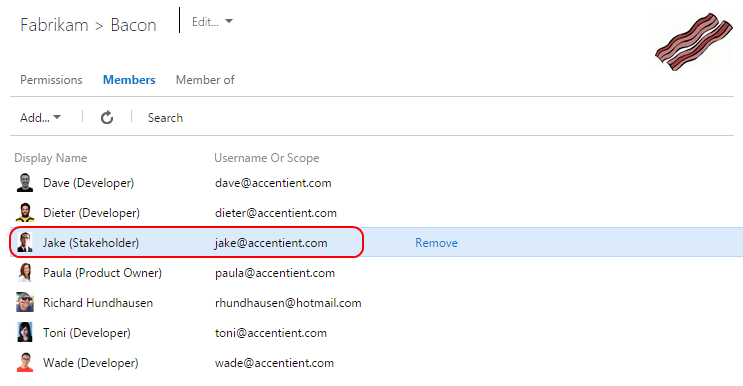
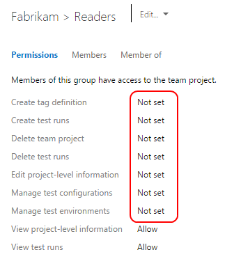
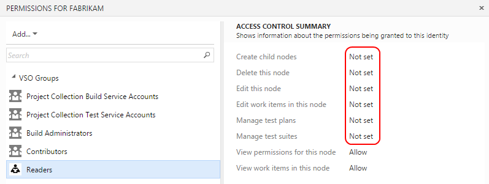
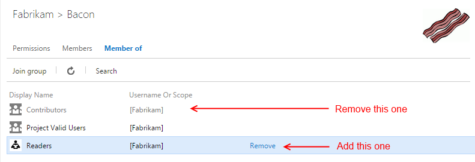

---
title: "Team members in the Readers group can create work items!"
date: 2014-11-17T12:02:25Z
authors: ["Richard Hundhausen"]
slug: "team-members-in-the-readers-group-can-create-work-items"
draft: false
tags: ["Azure DevOps", "Scrum", "TFS"]
---

---

Watch out. This could happen to you and your team.

Let's assume you have a single team project with three teams (Bacon, Lettuce, and Tomato) ...

Next, let's assume you have Jake, a stakeholder, asking for access to the team project. You don't want Jake to be able to add, edit, or delete anything, only to read data. Following <a href="http://msdn.microsoft.com/en-us/library/vstudio/bb558971.aspx" target="_blank" rel="noopener">MSDN's guidance</a>, you add Jake to the Readers group ...

Since Jake only cares about the work that Team Bacon is doing, you add him to that team ...

<a href="http://en.wikipedia.org/wiki/Bob's_your_uncle" target="_blank" rel="noopener">And Bob's your uncle</a> (translation: unfortunately Jake can now create work items, check-in code, etc.). The reason is that members of team Bacon are de facto <em>Contributors</em> to the team project.<em> </em>The fact that Jake is a member of the <em>Readers</em> group doesn't matter, because the <em>Readers</em>  group does not explicitly DENY any permissions at the team project scope ...

or at the work item area scope ...

<strong>The Workaround</strong>

You could obviously change the "Not set" permissions to "Deny" for the <em>Readers</em> group at the various scopes: team project, area, code, etc. I, Microsoft, and other of my fellow MVPs advise against this because of various performance and troubleshooting reasons.

A better workaround would be to remove Team Bacon from the <em>Contributors</em> group and add it to the <em>Readers</em> group ...

Then add the regular Team Bacon members to the Contributors group individually. At this point, Jake (the stakeholder) will have true read-only access as well as only being able to see Team Bacon's slice of the Product Backlog. The other members of Team Bacon will see no interruption in their day-to-day capabilities.

