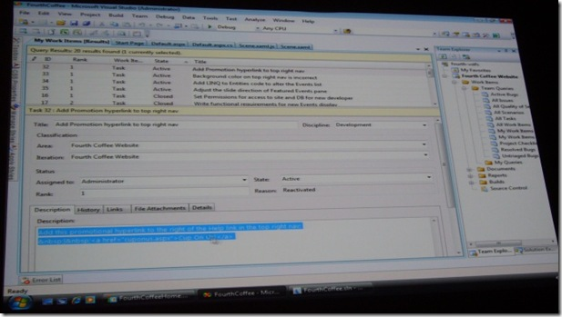

10:35 AM (Los Angeles)
 
A fictitious developer, from the fictitious company "Fourth Coffee" is demonstrating the new, agile development features in Visual Studio 2008. She's showing off how to manage team development projects (a.k.a. team projects and work items), giving her tasks to make some changes to her code. Mostly she is showing off the split-screen editor, synchronization of code and designer, integrated design tools, and the new JavaScript debugger.
 
 
 
Oops, she just called it "Team Services" as she closed out her work item. Well, we get the idea. :-)
