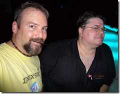
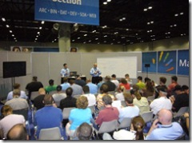

What a great week. I saw many friends ...
 
 
 
attended many parties ...
 
 
 
and&nbsp;learned a few new things ...
 
 
 
One of the technologies I heard about was <a href="http://writer.live.com/" target="_blank" rel="noopener">Windows Live Writer</a>, which provided me the ability to write blog posts offline, such as I'm doing right now!
