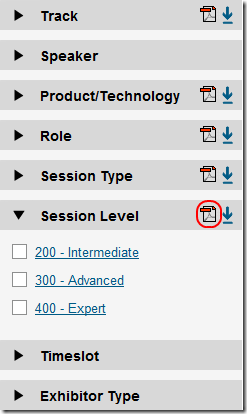

---
title: "Technical Session Levels (100, 200, 300, and 400)"
date: 2011-04-13T13:27:59Z
authors: ["Richard Hundhausen"]
slug: "technical-session-levels-100-200-300-and-400"
draft: false
tags: ["Conferences", "Microsoft"]
---

---

You always hear about "level 200", "level 300", and "level 400" talks at conferences. Well, I have always wondered there was a standard rating system that all speakers agree to. If so, whose rating system would it be? I know that there is a <a href="http://en.wikipedia.org/wiki/Motion_picture_rating_system" target="_blank" rel="noopener">standard system</a> for rating movies (G, PG, PG13, R, NC17). I tried to create a Wikipedia page a few years ago but it got removed because of some reason or another. Probably because nobody agreed with me.
 
So just today I was surfing the <a href="http://northamerica.msteched.com/contentcatalog?ck=no" target="_blank" rel="noopener">Microsoft Tech-Ed 2011 Session Catalog</a> and noticed there was a link to a <a href="http://northamerica.msteched.com/p/tena2011/resources/TENA2011_Session_Levels.pdf" target="_blank" rel="noopener">document that explains the various session levels</a>, as Tech-Ed understands them.
 

 
The document doesn’t list a 100 session level because Tech-Ed doesn’t contain any.

