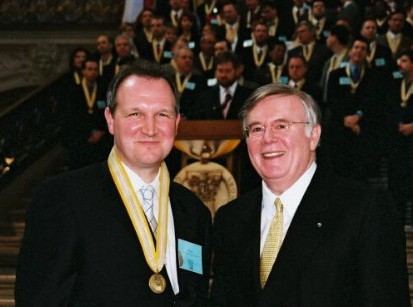

I've been meaning to post this for some time. Last year, the Windows DNA&nbsp;software project that I helped architect and design while I lived in Germany was&nbsp;recognized and won a couple of awards!

You can download TEPMIS' <a href="TEPMIS_CaseStudy.pdf">case study</a> in PDF form or view it <a href="https://secure.cwheroes.org/briefingroom_2003/pdf_frame/index.asp?id=4705" target="none" rel="noopener">online</a>. The short explanaition is that it is a &#8220;Worldwide consolidation of information about current events in Europe and Africa, gathered from multiple sources including all branches of the military, supports automated production of briefing books and slide presentations that assure the commanders know what the current situation is.&#8220;

Here's <a href="http://www.cwheroes.org/his_4a_detail.asp?id=4705" target="none" rel="noopener">another link</a> that explains the project. Thanks to <a href="http://www.jeffingermany.com/" target="none" rel="noopener">Jeff Temple</a> for sending me this link. Here he is accepting the award for all of us!
