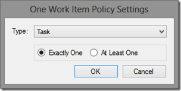

---
title: "TFS 2013 Best Practices Analyzer (BPA) fails with %TFSServerURLValidated% error"
date: 2014-02-14T09:16:10Z
authors: ["Richard Hundhausen"]
slug: "tfs-best-practices-analyzer-bpa-fails"
draft: false
tags: ["Preferred Practice", "TFS"]
---

---

Earlier this week I installed the <a href="http://visualstudiogallery.msdn.microsoft.com/f017b10c-02b4-4d6d-9845-58a06545627f" target="_blank" rel="noopener">Team Foundation Server 2013 Power Tools</a> and went to run a BPA scan. It finished very quickly, giving me a couple of strange <em>%TFSServerURLValidated%</em> messages …

Viewing the report showed an additional warning “Cannot validate the URL provided”. I double-checked the spelling of my TFS URL, but it was fine. By selecting the “Other Reports” option, I was able to find the root cause …

So I began my research of the “Incorrect Windows PowerShell version 3.0. Windows PowerShell version 2.0 is supported in the current console.” error message and tried many things …

Tried running BPA as Administrator (try the easy stuff first, right?)

Correct versions of PowerShell were installed

PowerShell ExecutionPolicy was set to RemoteSigned

The WinRM service was running and configured to support basic authentication

Still stumped, I reached out to some fellow Visual Studio ALM MVPs and <a href="http://blog.stangroome.com/" target="_blank" rel="noopener">Jason Stangroome</a> gave me the answer, which I’m paraphrasing here …

“The error message is coming from within PowerShell. BPA is trying to add the "TfsBPAPowerShellSnapIn" snapin into the in-process PowerShell runspace but the snapin is reporting that it expects v3 of PowerShell whilst the BPA in-process runspace is hosting PSv2. On an OS with PowerShell v3 or later installed, switching between the two is performed by switching between CLR 2 and CLR 4. Checking the TFS BPA assemblies shows that they are compiled for CLR 2. So, either BPA needs to run under CLR 4, or the TfsBPAPowerShellSnapIn needs to report that it works with PSv2.”

Following Jason’s lead, I created a TfsBpa.exe.Config file in the C:Program Files (x86)Microsoft Team Foundation Server 2013 Power ToolsBest Practices Analyzer folder and added these lines to it to force the CLR 4 to be used …

&lt;configuration&gt;
&nbsp;&lt;startup&gt;
&nbsp;&nbsp;&lt;supportedRuntime version=&quot;v4.0.30319&quot;/&gt;
&nbsp;&lt;/startup&gt;
&lt;/configuration&gt;

BPA is working great now …

