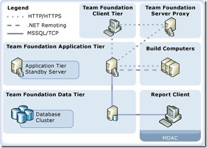

Thanks to the Team System Rangers (an elite squad of TFS experts inside Microsoft) for putting together this document, which serves as a single point of entry into the world of TFS Operations as well as Microsoft's recommended operational best practices.
 
 
 
So, start learning/mastering TFS operations by clicking <a href="http://msdn2.microsoft.com/en-us/library/bb663036(VS.80).aspx" target="_blank" rel="noopener">here</a>.
