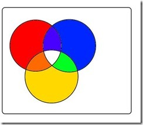
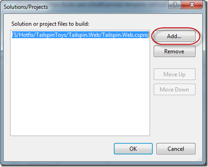
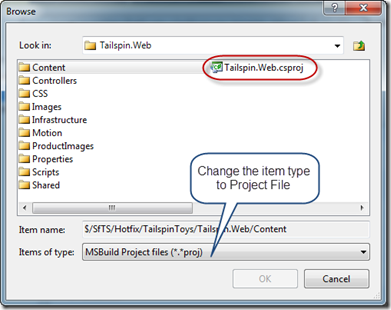
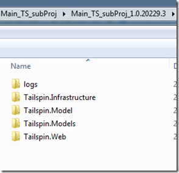

---
title: "TFS2010 Build output to a Custom Folder Structure"
date: 2012-02-29T10:38:03Z
authors: ["Simon Reindl"]
slug: "tfs2010-build-output-to-a-custom-folder-structure"
draft: false
tags: ["TFS", "Visual Studio", "ALM"]
---

---

<h1>How to output TFS2010 build output to a subfolder</h1>
The scenario that exists is that I need to build a more detailed tree structure in the build output. I was looking for the least intrusive means of being able to get the build to output to subfolders.

So, I took a branch of the default build template (so I didn’t mess with the rest of the team while I experimented) and started to edit.

&nbsp;

Drilling through the workflow until you were at the <b>Compile the Project</b> sequence (Overall Build Process; Run On Agent; Try Compile, Test, and Associate Changesets and Work Items; &lt;expand&gt;; Try Compile and Test; Compile and Test; For Each Configuration in BuildSettings.PlatformConfigurations; Compile and Test for Configuration; If BuildSettings.HasProjectsToBuild; For Each Project in BuildSettings.ProjectsToBuild; Try to Compile the Project; and finally Compile the project)

&nbsp;

I added a new string variable called <strong>outputDirForProj</strong> scoped for that sequence.

Add in an assign activity setting the <strong>outputDirForProj </strong>to:
<pre class="csharpcode"> System.IO.Path.Combine(outputDirectory, System.IO.Path.GetFileNameWithoutExtension(localProject))</pre>

<strong>Note 1:</strong>

I wanted the output to go toProjectFolderOutput

If you want SolutionFolderProjectFolderOutput
<pre class="csharpcode">System.IO.Path.Combine(outputDirectory, System.IO.Directory.GetParent(System.IO.Directory.GetParent(localProject).ToString()).Name, System.IO.Path.GetFileNameWithoutExtension(localProject))</pre>

Of course you could put in a build attribute, and manipulate this whichever way you want to.

The trick is 1) You are in VB and 2) getting the folder name

Technorati Tags: <a href="http://technorati.com/tags/TFS2010" rel="tag">TFS2010</a>,<a href="http://technorati.com/tags/Build" rel="tag">Build</a>,<a href="http://technorati.com/tags/SubFolders" rel="tag">SubFolders</a>,<a href="http://technorati.com/tags/Customization" rel="tag">Customization</a>

<strong>Note 2:</strong>

Your code (or test) project MUST have a name attribute for this to work. (I’ll put that in another post)

&nbsp;

And after that add a build message (set to high so that I always see it – out of personal preference) with the text
<pre class="csharpcode">String.Format("Copying build output to {0} ", outputDirForProj)</pre>

It ends up looking like:

&nbsp;

&nbsp;

Then set the MSBuild task properties to use the added directory

&nbsp;

&nbsp;

Check in and the build is ready, then you need to edit the build definition to use target projects, not solutions,

In the build definition, select the individual projects instead of the solutions.

and the resulting output will use the project structure.

