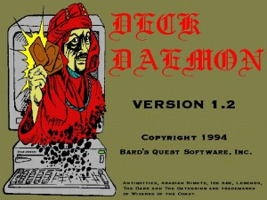
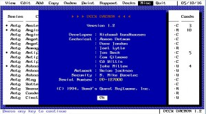
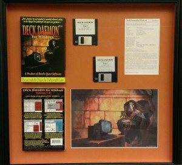
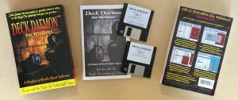
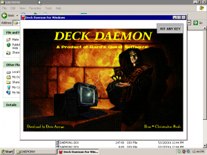
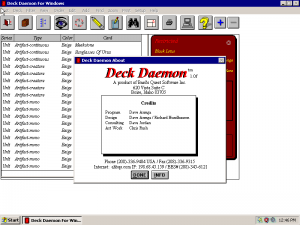
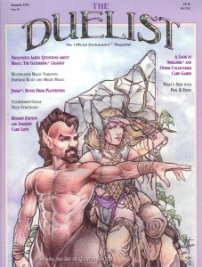
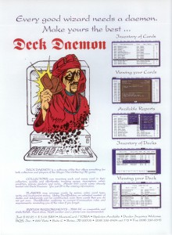
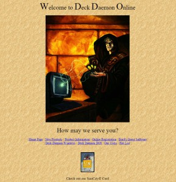
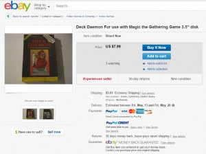

Yes, this was software that I wrote in 1993 - DOS-based, written in <a href="https://en.wikipedia.org/wiki/Clipper_(programming_language)" target="_blank" rel="noopener">Clipper</a>, to help players and collectors of <a href="https://en.wikipedia.org/wiki/Magic:_The_Gathering" target="_blank" rel="noopener">Magic: The Gathering</a> card game organize their collections, trade cards, and track their decks. It was a fun utility to build, and an eye-opening experience as far as how *not* to run a business.

Here is the splash screen for the DOS version ...

And the awesome UI of the DOS version ...

<a href="http://bit.ly/24POStx" target="_blank" rel="noopener">Dave Armga</a> created a Windows version (for which we commissioned <a href="http://magic.wizards.com/en/articles/archive/feature/christopher-rush-2016-02-11" target="_blank" rel="noopener">Christopher Rush</a> to create custom artwork) ...

Here's a recently opened Windows version box ...

And the splash screen for the Windows version ...

And the awesome UI of the Windows version ...

Our first advertisement was in the Duelist Magazine #2 ...

I also managed to find a copy of our old website too ...

It's funny, it's been more than 20 years on, and copies of the DOS version still pop up on eBay now and then ...

If you're interested, you can download the <a href="https://accentient.com/blog/files/deckdaemondos.zip">DOS</a> version and <a href="https://accentient.com/blog/files/deckdaemonwindows.zip">Windows</a> version and check them out. No setup program to run, just unzip in a folder and double click the EXE. You might want to have a DOS 6.22 and Windows 95 (respective) virtual machines handy to do this. :-)